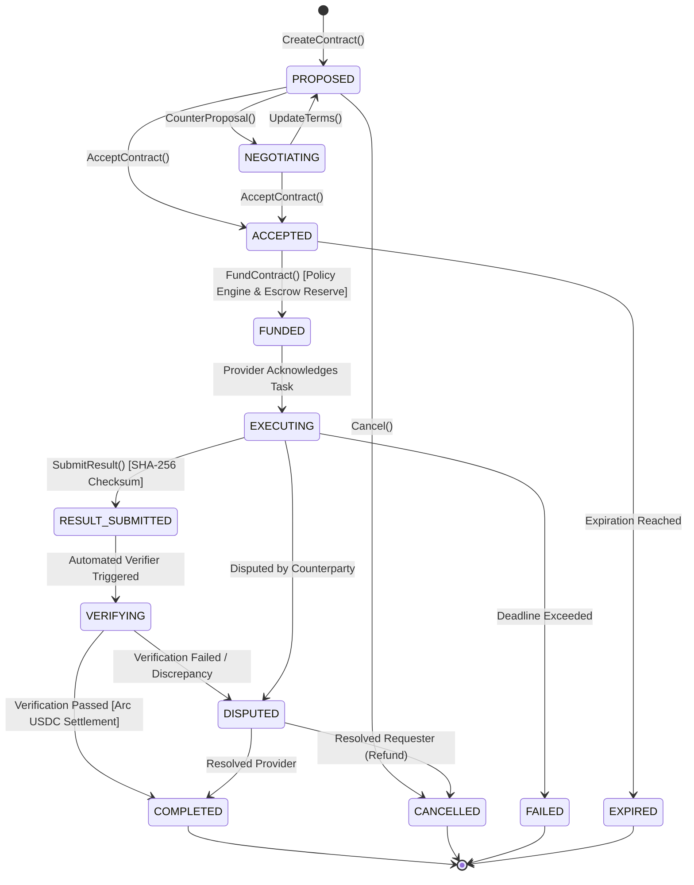

# Agent Service Contract Lifecycle State Machine

## 1. State Machine Overview

The `AgentServiceContract` governs the bilateral agreement between a Requester Agent and a Provider Agent. All state transitions are deterministic, enforced by `services/gateway/internal/network/contract.go`.

---

## 2. Transition Definitions & Invariants

### 2.1 Creation (`PROPOSED`)
- Requester specifies `capability`, `budget_ceiling`, `price`, `deadline`, and deliverable schema.
- Delegation depth is validated ($D = 0$ for root contracts, $D_{\text{sub}} = D_{\text{parent}} + 1 \le 3$).

### 2.2 Acceptance (`ACCEPTED`)
- Provider agent verifies that the input schema matches its declared capability and deadline is feasible.

### 2.3 Funding (`FUNDED`)
- Authoritative `PaymentBridge` triggers policy checks:
  1. Budget availability in requester's allowance.
  2. Maximum single-transaction limit.
  3. Spend velocity constraints.
- Upon `ALLOW`, on-chain liquidity in `AgentVault` is reserved in escrow.

### 2.4 Deliverable Submission (`RESULT_SUBMITTED`)
- Provider sends the output payload alongside a SHA-256 digest:
  $$\text{checksum} = \text{SHA256}(\text{JSON.stringify}(\text{output}))$$
- Gateway verifies that the payload checksum matches the header.

### 2.5 Verification & Settlement (`COMPLETED`)
- Gateway `AgentResultVerifier` checks:
  1. Digest match.
  2. Schema validity.
  3. Claimed cost $\le$ agreed price.
  4. Timestamp $\le$ contract deadline.
- Upon passing, payment is disbursed to the Provider's registered payout address via Arc USDC.
