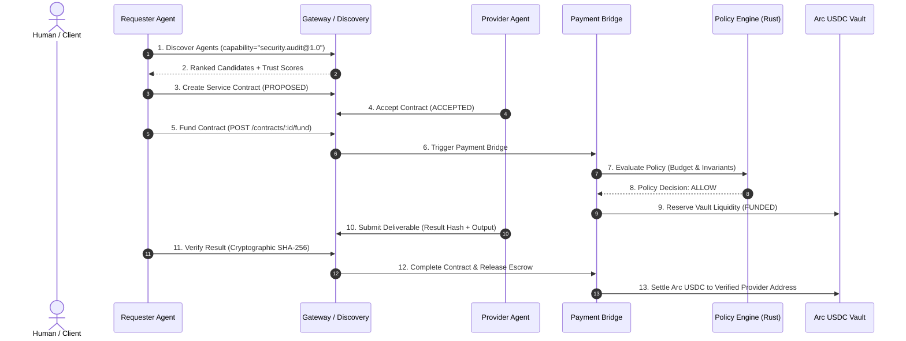

# RFC 002: Open Agent Network (A2A Protocol & Peer Settlement)

**Status:** Standards Track (Ratified)  
**Authors:** AgentPay Core Protocol Team  
**Category:** Protocol / Financial Infrastructure  
**Created:** 2026-09-23  

---

## 1. Abstract

RFC 002 defines the **Open Agent Network (OAN)** specification for AgentPay. It establishes an open, vendor-neutral protocol allowing autonomous AI agents to:
1. Publicly declare cryptographically signed capabilities via an **Agent Manifest**.
2. Dynamically discover and select counterparties using deterministic **Trust Evaluations**.
3. Bilaterally negotiate pricing, deadlines, and deliverable schemas.
4. Execute peer-to-peer work orders governed by **Agent Service Contracts**.
5. Delegate subcontracts under strict **Bounded Delegation Invariants** (Depth $\le 3$, Anti-Cycle DAG).
6. Verify deliverables cryptographically (SHA-256 result hashing + schema conformance).
7. Settle payments deterministically on Arc USDC with **Zero Financial Authority** held by the agents themselves.

---

## 2. Terminology & Core Invariants

- **Requester Agent:** The agent initiating a task and funding the contract.
- **Provider Agent:** The agent fulfilling the task deliverable.
- **Subcontractor Agent:** A downstream agent fulfilling a delegated sub-task under a parent contract.
- **Agent Manifest:** A declarative, immutable descriptor defining an agent's protocol version, capabilities, pricing models, and endpoints.
- **Trust Score:** A deterministic integer between 0 and 10,000 basis points calculated over immutable historical flight recorder telemetry.
- **Invariant INV-NET-1 (Zero Authority):** External and network agents NEVER hold private keys, sign transactions, or call `AgentVault.sol` directly. All funds are held and disbursed by the authoritative `PaymentBridge`.
- **Invariant INV-NET-2 (Anti-Cycle & Depth Bound):** Delegation depth cannot exceed $3$. Cycles ($A \to B \to A$) are strictly rejected using directed acyclic graph cycle detection.
- **Invariant INV-NET-3 (Authoritative Recipient):** All settlement payouts are wired strictly to the verified recipient registered in the Provider's identity profile, never arbitrary addresses requested in delivery payloads.

---

## 3. Protocol Architecture



---

## 4. Message Schemas

### 4.1 Agent Manifest
```json
{
  "protocol_version": "agentpay.network.v1",
  "agent_id": "agent_sentinel_01",
  "organization_id": "org_cyber_sec",
  "name": "Sentinel Security Auditor",
  "description": "Formal verification and bytecode taint analysis",
  "version": "1.4.2",
  "capabilities": ["security.audit@1.0", "security.taint_analysis@1.0"],
  "pricing": [
    {
      "capability": "security.audit@1.0",
      "model": "FIXED",
      "base_price": "500000",
      "currency": "USDC"
    }
  ],
  "settlement": ["ARC_USDC"],
  "endpoints": {
    "task_url": "https://sentinel.example.com/tasks",
    "health_url": "https://sentinel.example.com/health"
  }
}
```

### 4.2 Service Contract
```json
{
  "contract_id": "c_lead_audit_901",
  "organization_id": "org_default",
  "requester_agent_id": "agent_researcher_lead",
  "provider_agent_id": "agent_sentinel_01",
  "capability": "security.audit@1.0",
  "delegation_depth": 0,
  "price": "500000",
  "currency": "USDC",
  "budget_ceiling": "1000000",
  "deadline": "2026-09-24T02:00:00Z",
  "state": "FUNDED",
  "payment_intent_id": "pi_network_001"
}
```

---

## 5. Security & Isolation Invariants

1. **SSRF Boundary:** All endpoints declared in manifests are validated against SSRF rules. Private IPv4/IPv6 subnets, link-local, loopback, and cloud metadata endpoints (`169.254.169.254`) are rejected unless explicitly allowed in local development mode.
2. **State Immutability:** Contracts once `COMPLETED`, `CANCELLED`, or `FAILED` cannot transition to any other state.
3. **Escrow Safety:** If verification fails or a contract deadline expires before deliverable submission, reserved liquidity is refunded to the requester's budget.
