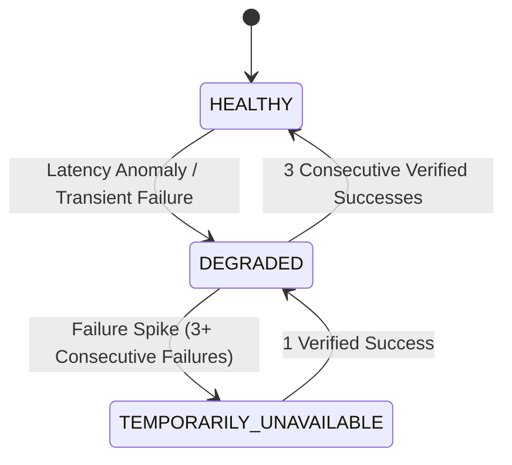

# AgentPay Anomaly Detection & Circuit Breaker Architecture

## 1. Overview
The Anomaly Detection subsystem continuously evaluates economic observations against statistical baselines to detect provider anomalies, fee gouging, latency inflation, and cascading failure patterns.

---

## 2. Statistical Divergence Signals

The detector evaluates four primary anomaly categories:

### 2.1 Price Anomaly (`PRICE_ANOMALY`)
Triggers when a quoted price is greater than or equal to $2.0 \times$ ($200\%$) of the service's 7-day rolling baseline:
$$\text{QuotedPrice} \ge 2.0 \times \text{AvgPrice}_{\text{baseline}}$$

### 2.2 Latency Anomaly (`LATENCY_ANOMALY`)
Triggers when execution latency exceeds $2.5 \times$ ($250\%$) of the service's historical baseline:
$$\text{ExecutionLatency} \ge 2.5 \times \text{AvgLatency}_{\text{baseline}}$$

### 2.3 Failure Spike (`FAILURE_SPIKE`)
Triggers when either:
- The recent failure rate exceeds the historical baseline by $> 5000\text{ bps}$ ($50\%$):
  $$\text{RecentFailureRate} - \text{BaselineFailureRate} > 5000\text{ bps}$$
- Three or more consecutive failures are recorded (`consecutive_failures >= 3`).

### 2.4 Quality Degradation (`QUALITY_DEGRADATION`)
Triggers when verified result quality drops by $> 2500\text{ bps}$ ($25\%$) against baseline.

---

## 3. Circuit Breaker States

The circuit breaker maintains an internal state for every registered service:

- **`HEALTHY`**: Service is eligible for automated candidate ranking and hiring.
- **`DEGRADED`**: Service exhibits anomalous behavior; utility score receives a heavy penalty ($2500\text{ bps}$ discount), deprioritizing it behind healthy alternatives.
- **`TEMPORARILY_UNAVAILABLE`**: Service is automatically filtered from automated candidate selection. Requires manual re-enablement or successful probationary execution.

---

## 4. Advisory Nature of Anomaly Signals

> [!NOTE]
> Anomaly signals and circuit breaker flags generated by the intelligence layer are **advisory recommendations**.
> They influence candidate discovery and rank sorting, but **do not mutate on-chain permissions or override hard organizational policy**.
