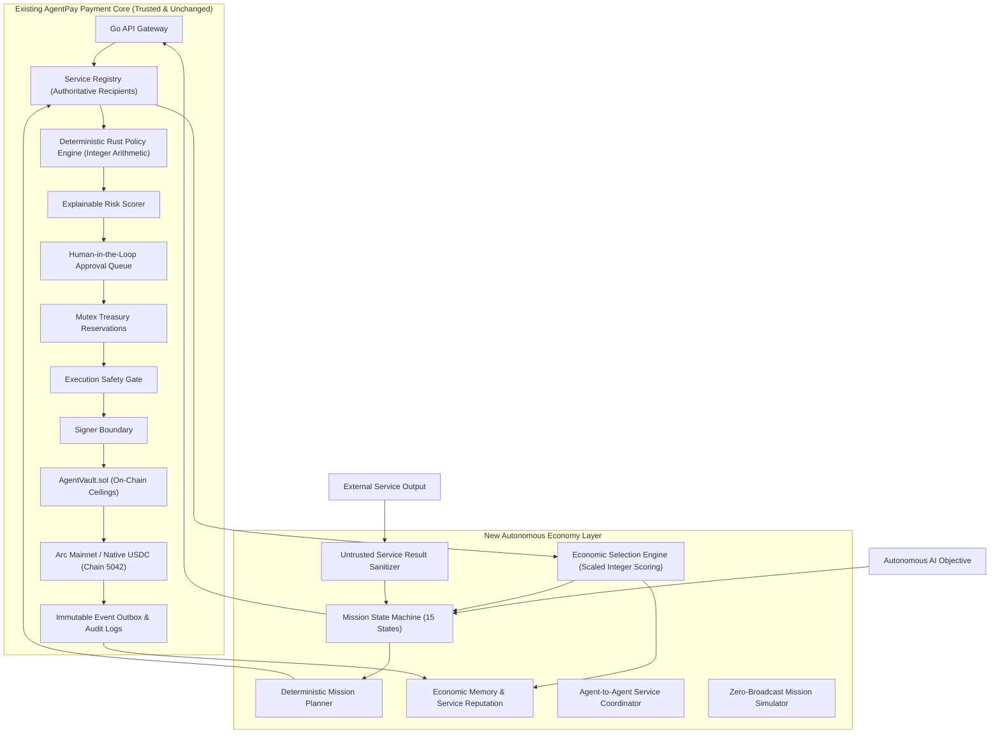

# AgentPay Autonomous Economy Engine: Architecture & Security Specification

**Author:** Principal Engineer & CTO  
**Project:** AgentPay (`mahitss/Arc_micro`)  
**Status:** Approved Architectural Design  
**Classification:** Core System Architecture  

---

## 1. Executive Summary

AgentPay is evolving from a secure payment gateway into an **Autonomous Economic Operating System**. 
In this paradigm, autonomous AI agents can:
1. Formulate high-level objectives (**Missions**).
2. Decompose objectives into deterministic capability steps (**Planning**).
3. Query an authoritative registry of external services and peer agents (**Discovery**).
4. Solicit cryptographically time-bound cost and delivery commitments (**Quotes**).
5. Deterministically evaluate and rank alternatives without subjective LLM nondeterminism (**Economic Selection Engine**).
6. Dispatch payment proposals through the unbypassable AgentPay verification pipeline (**Policy & Risk Enforcement**).
7. Ingest external service responses strictly as passive, untrusted data payloads (**Untrusted Service Result Boundary**).
8. Record continuous service performance and reputation to inform future economic decisions (**Economic Memory & Reputation**).

### North Star Invariant
> **AI Requests → AgentPay Deterministically Controls → Arc Settles**
>
> The AI agent (and any external service LLM) remains an untrusted actor. No LLM can authorize money, select arbitrary recipients, modify policies, bypass approvals, generate unvalidated calldata, or hold cryptographic private keys.

---

## 2. Existing vs. New Architecture

---

## 3. Domain Boundaries & New Entities

### 3.1 Mission (`Mission`)
A Mission represents a discrete, budgeted economic undertaking with an explicit, strictly enforced state machine.
- `id`: Unique identifier (`msn_<uuid>`).
- `organization_id`: Multi-tenant isolation boundary.
- `agent_id`: The originating autonomous agent.
- `objective`: High-level natural language description.
- `status`: One of 15 explicit states (`CREATED`, `PLANNING`, `DISCOVERING`, `EVALUATING`, `SELECTING`, `AWAITING_APPROVAL`, `EXECUTING`, `WAITING_FOR_RESULT`, `EVALUATING_RESULT`, `CONTINUING`, `COMPLETED`, `FAILED`, `CANCELLED`, `BUDGET_EXHAUSTED`, `EXPIRED`).
- `budget`: Total authorized spending cap (in base units, e.g. micro-USDC).
- `spent`: Total settled disbursement.
- `remaining_budget`: `budget - spent - reserved`.
- `currency`: Default `"USDC"`.
- `max_execution_amount`: Cap on any individual step within the mission.
- `deadline`: Hard cutoff timestamp after which all pending actions abort.
- `current_step`: Index/ID of the active planning step.
- `correlation_id`: Distributed trace binding.

### 3.2 Quote (`Quote`)
An immutable, cryptographically verifiable pricing commitment issued by a service provider or registry adapter.
- `quote_id`: `qt_<hex>`.
- `service_id`: Authoritative service identifier.
- `mission_id`: Associated mission.
- `price`: Integer base units (micro-USDC). Floating-point prohibited.
- `asset`: `"USDC"`.
- `estimated_latency_ms`: Expected turnaround.
- `quality_score`: Scaled integer metric (0-10000 basis points).
- `risk_score`: Scaled integer risk indicator.
- `reputation_score`: Scaled integer historical rating.
- `expires_at`: UTC timestamp after which the quote cannot be accepted.
- `recipient_binding`: Authoritative address permanently locked at creation.

### 3.3 Service Reputation & Economic Memory (`ServiceReputation`, `EconomicProfile`)
Tracks longitudinal performance metrics per organization and global platform level:
- `total_requests`, `successful_requests`, `failed_requests`.
- `total_volume_settled` (base units).
- `average_price`, `average_latency_ms`.
- `failure_rate` (basis points).
- `reputation_score` (0-10000).

### 3.4 Agent-to-Agent Service (`AgentService`)
Treats peer AI agents as registered economic providers within the registry without giving them bilateral wallet access. All inter-agent payments route through `AgentVault.sol`.

---

## 4. Trust Boundaries & Why LLM Authority Remains Limited

| Component | Trust Level | Capabilities | Strict Restrictions |
|---|---|---|---|
| **AI Agent / LLM** | **UNTRUSTED** | Formulate objectives, propose steps, format prompts. | **Zero** financial authority; cannot hold keys; cannot select arbitrary recipients; cannot alter budgets. |
| **Mission Planner** | **BOUNDED** | Breaks objectives into needed capabilities & max budgets. | Only generates proposals; every step must pass the Go Gateway & Rust Policy. |
| **Economy Selection Engine** | **DETERMINISTIC** | Scores and ranks candidate quotes using pure integer arithmetic. | Cannot approve payments; only sorts candidates based on public weights. |
| **External Service Output** | **UNTRUSTED DATA** | Returns computation, research datasets, API payloads. | Sanitized as passive data; cannot execute prompts, override policy, or alter state. |
| **AgentPay Core (Gateway, Rust, Treasury)** | **AUTHORITATIVE** | Validates schema, evaluates policy, locks balances, signs transactions. | Hard DENY is non-negotiable; human approval required for high risk. |
| **AgentVault (Arc Smart Contract)** | **CRYPTO-ENFORCED** | Enforces daily velocity, per-tx limits, and recipient allowlists on-chain. | Cannot be overridden even if server memory is corrupted. |

---

## 5. Mathematical Economic Selection Formula

The `EconomyEngine` evaluates candidate quotes using a **strictly deterministic, integer-based scaled utility formula** (scaled to basis points `[0, 10,000]`):

$$\text{Utility} = W_Q \cdot \bar{Q} + W_{Rel} \cdot \bar{Rel} + W_{Rep} \cdot \bar{Rep} + W_L \cdot \bar{L} - W_P \cdot \bar{P} - W_R \cdot \bar{R}$$

Where:
- All normalized attributes ($\bar{Q}, \bar{Rel}, \bar{Rep}, \bar{L}, \bar{P}, \bar{R}$) and weights ($W_i$) are non-negative integers summing to 10,000.
- $\bar{P}$ (Price Penalty) scales monotonically with the quote price relative to step budget.
- $\bar{L}$ (Latency Score) penalizes high latency relative to expected turnaround.
- $\bar{Rel}$ & $\bar{Rep}$ derive from `ServiceReputation`.

### Deterministic Tie-Breaking Protocol
If two candidates achieve identical Utility Scores:
1. Lower Price (Base Units).
2. Higher Reliability (Basis Points).
3. Lower Latency (Milliseconds).
4. Lexicographical Service ID (Ascending).
**Randomness is strictly prohibited.**

---

## 6. Financial & Security Invariants (INV-E1 to INV-E12)

- **INV-E1 (Mission Budget Cap):** Cumulative settled spend + active reservations for a mission can NEVER exceed `mission.budget`.
- **INV-E2 (Agent Daily Cap):** Agent daily spend across all missions cannot exceed `policy.daily_limit`.
- **INV-E3 (No Direct LLM Authorization):** LLM generation alone cannot trigger execution; authorization requires Rust Policy Engine clearance.
- **INV-E4 (Untrusted Data Inviolability):** External service outputs cannot alter financial parameters, budgets, recipients, or state machine transitions.
- **INV-E5 (Authoritative Recipient Binding):** All payments settle strictly to the address registered in `ServiceRegistry` by administrative authority.
- **INV-E6 (Hard DENY Inviolability):** A `DENY` decision from the Rust Policy Engine halts the step immediately; no override or human approval can execute it.
- **INV-E7 (Approval Cannot Override Hard DENY):** The approval system only elevates `APPROVAL_REQUIRED` states; it cannot convert `DENY` to `ALLOW`.
- **INV-E8 (Simulation Zero-Broadcast):** Simulation runs execute full planning and policy evaluation, but are mathematically barred from calling the signer or mutating treasury balances.
- **INV-E9 (Idempotent Step Execution):** Re-submitting a mission step with the same correlation or idempotency key returns the existing transaction without double-spending.
- **INV-E10 (Cross-Org Isolation):** Missions, budgets, reputations, and audit traces are partitioned by `organization_id`.
- **INV-E11 (Zero Direct Vault Access):** Neither agents nor services have direct RPC access or private keys to call `AgentVault.sol`.
- **INV-E12 (Single Payment Path):** The Autonomous Economy Engine creates payment proposals that MUST flow through the canonical `PaymentIntent` → Policy → Risk → Treasury → Signer pipeline.
