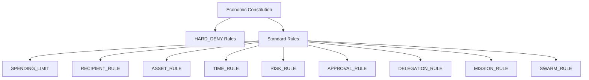
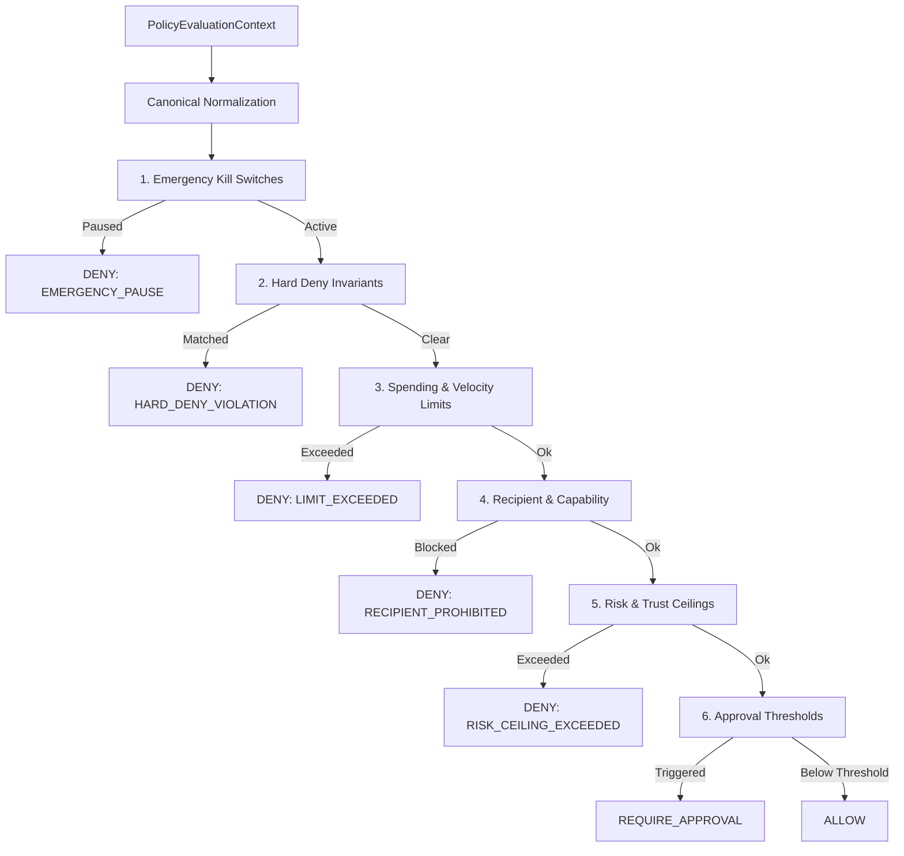
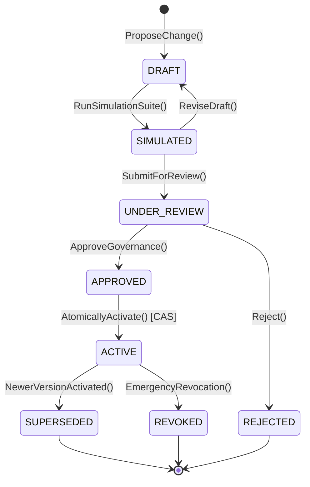

# AgentPay Economic Constitution Architecture

**Status:** Approved & Ratified  
**Subsystem:** Economic Constitution & Constitutional Governance  
**Layer:** Core Control Plane  
**Authors:** AgentPay Core Protocol Team  
**Date:** 2026-09-24  

---

## 1. Executive Summary & Core Thesis

AgentPay is the autonomous economic operating system for AI agents, governed by the foundational principle:

> **AI REQUESTS → AGENTPAY CONTROLS → ARC SETTLES**

As autonomous agents transition from single-step tasks to multi-agent swarms, recursive mission hierarchies, and decentralized peer-to-peer networks, traditional static spending limits are insufficient. Agents require economic agency to discover capabilities, bargain deliverables, and compensate counterparties. However, allowing autonomous agents direct cryptographic access to private keys or unbounded financial elevation introduces existential risk.

The **AgentPay Economic Constitution** establishes a programmable, deterministic, versioned financial governance framework. It operates under two fundamental tenets:

1. **"Agents may optimize within the constitution. Agents may never modify the constitution."**
2. **"Autonomy is the variable. Financial authority is the constant."**

The constitution enforces hard limits on what agents may spend, where they may spend, how much they may allocate, which actions mandate human approval, and which behaviors are permanently prohibited.

---

## 2. Current Architecture vs. Constitutional Architecture

### 2.1 Current Policy Primitives (Reused Unchanged)
AgentPay previously established:
- A high-throughput, pure deterministic **Rust Policy Engine** (`services/policy-engine`) performing check-based authorizations in sub-millisecond time.
- A **Policy Composition Model** (`composition.rs`) merging organization-level and agent-level constraints.
- An **Emergency Controller** (`services/gateway/internal/emergency`) enforcing multi-tier fail-closed kill switches (`PauseAgent`, `PauseOrganization`, `PauseGlobalExecution`).
- A **Flight Recorder & Audit Pipeline** recording state transitions and cryptographic transaction hashes on Arc USDC.

### 2.2 The Constitutional Architecture
The Economic Constitution formalizes and expands these primitives into an end-to-end governance system:

```
                          GLOBAL SECURITY & KILL SWITCHES
                                         │
                                         ▼
                            GLOBAL HARD DENY INVARIANTS
                                         │
                                         ▼
                               ORGANIZATION CONSTITUTION
                                (Active Version vN)
                                         │
                                         ▼
                                    AGENT POLICY
                                         │
                                         ▼
                                  MISSION CONSTRAINTS
                                         │
                                         ▼
                                   SWARM BUDGET
                                         │
                                         ▼
                                     TASK NODE
                                         │
                                         ▼
                                   PAYMENT INTENT
```

Every level in the hierarchy can **only narrow** financial authority. A child scope cannot expand spending limits, broaden allowlists, or bypass human approval thresholds.

---

## 3. Hierarchical Inheritance & Monotonic Authority Reduction

### 3.1 Non-Escalation Invariant
The central mathematical invariant of the constitution is **Monotonic Authority Reduction**:
$$\text{Authority}(\text{Child}) \subseteq \text{Authority}(\text{Parent})$$

When resolving effective rules across the inheritance tree:
1. **Spending Limits:** Strictly the minimum:
   $$\text{Limit}_{\text{effective}} = \min(\text{Limit}_{\text{Org}}, \text{Limit}_{\text{Agent}}, \text{Limit}_{\text{Mission}}, \text{Limit}_{\text{Swarm}}, \text{Limit}_{\text{Task}})$$
2. **Recipient Allowlists:** Strictly the intersection:
   $$\text{AllowedRecipients}_{\text{effective}} = \bigcap \text{AllowedRecipients}_i$$
3. **Recipient Blocklists:** Strictly the union:
   $$\text{BlockedRecipients}_{\text{effective}} = \bigcup \text{BlockedRecipients}_i$$
4. **Human Approval Thresholds:** Strictly the minimum:
   $$\text{Threshold}_{\text{effective}} = \min(\text{Threshold}_i)$$
5. **Emergency Pauses:** Boolean OR (if any parent is paused, all descendant operations halt):
   $$\text{Paused}_{\text{effective}} = \text{GlobalPaused} \lor \text{OrgPaused} \lor \text{AgentPaused} \lor \text{MissionPaused}$$

---

## 4. Rule Taxonomy

The constitution defines 9 explicit rule categories plus top-level `HARD_DENY` rules:



### 4.1 Rule Definitions
1. **`SPENDING_LIMIT`:** Maximum single transaction, daily spend, hourly velocity, mission cap, and swarm cap (expressed in integer base units, e.g. micro-USDC).
2. **`RECIPIENT_RULE`:** Explicit allowlists and denylists for services, counterparty agent IDs, organization IDs, and capability identifiers.
3. **`ASSET_RULE`:** Authorized currency assets. By default, strictly `USDC` settled on Arc. Arbitrary token execution is rejected.
4. **`TIME_RULE`:** Authorized execution schedules, maintenance blackout windows, and automatic rule expiration timestamps.
5. **`RISK_RULE`:** Threshold ceilings for composite risk scores, external agent risk classification, maximum anomaly scores, and minimum counterparty trust score.
6. **`APPROVAL_RULE`:** Deterministic conditions requiring explicit human approval (e.g., amount $> 10 \text{ USDC}$, first-time counterparty, high-risk capability).
7. **`DELEGATION_RULE`:** Bounded delegation limits: maximum recursion depth ($\le 3$), maximum inherited budget allocation, and restricted subcontracting capabilities.
8. **`MISSION_RULE`:** Maximum mission lifetime duration, maximum concurrent external agents, and maximum parallel tasks.
9. **`SWARM_RULE`:** Maximum swarm collective budget, maximum fan-out factor, and maximum active worker count.
10. **`HARD_DENY`:** Absolute prohibitions that **cannot** be overridden by human approval, agent reputation, simulation outputs, or LLM reasoning. Preserves the invariant: **APPROVAL CANNOT OVERRIDE DENY**.

---

## 5. Pure Deterministic Evaluation Flow

The `ConstitutionEvaluator` is a pure function. It accepts a `PolicyEvaluationContext` and outputs a `ConstitutionDecision`.



### Invariants of the Evaluator
- **Zero I/O During Evaluation:** No database queries, no network calls, no external clock calls during evaluation.
- **Fail-Closed:** Any malformed context, missing field, or unexpected internal state immediately yields `DENY`.
- **Reproducible:** The evaluation tuple `(Context, Constitution)` produces an identical `evaluation_hash` across all executions.

---

## 6. Cryptographic Policy Hashing & Authorization Snapshots

### 6.1 Canonical Policy Hash
Every constitution is serialized into a deterministic canonical JSON representation (keys sorted lexicographically, whitespace normalized) and hashed via SHA-256:
$$\text{policy\_hash} = \text{SHA256}(\text{CanonicalJSON}(\text{Constitution}))$$

### 6.2 Policy Snapshot (`PolicySnapshot`)
At the exact moment of financial authorization, an immutable snapshot is bound to the transaction:
```json
{
  "snapshot_id": "snap_01J8K...",
  "constitution_id": "const_org_default",
  "version": 7,
  "policy_hash": "e3b0c44298fc1c149afbf4c8996fb92427ae41e4649b934ca495991b7852b855",
  "decision": "ALLOW",
  "effective_limits": {
    "max_per_tx": "10000000",
    "daily_budget": "50000000",
    "asset": "USDC"
  },
  "evaluated_at": "2026-09-24T00:00:00Z"
}
```
**Historical decisions are never re-evaluated against new policy versions.** If a payment intent is delayed and the constitution advances between creation and execution, the Stale Policy Protection gate triggers revalidation.

---

## 7. Versioning & Governance Lifecycle

Constitutions are immutable and monotonically versioned ($v1, v2, v3, \dots$). Existing versions are never updated in place.



### 7.1 Twelve-Step Activation Pipeline
Before a candidate constitution can transition to `ACTIVE`, it must pass all 12 validation gates:
1. **Schema Validation:** Structural JSON schema conformant.
2. **Version Monotonicity:** Proposed version equals $\text{ActiveVersion} + 1$.
3. **Canonical Hash Calculation:** Deterministic SHA-256 computed.
4. **Structural Diff Analysis:** Detailed diff generated against the active version.
5. **Authority Delta Calculation:** Computed as `MORE_RESTRICTIVE`, `UNCHANGED`, or `MORE_PERMISSIVE`.
6. **Policy Test Suite:** All automated test cases pass with 100% compliance.
7. **Digital Twin Simulation:** Historical and synthetic scenario batch simulation succeeds.
8. **Risk Analysis:** Tail exposure and worst-case scenario remain within organizational tolerances.
9. **Approval Verification:** If `MORE_PERMISSIVE`, multi-signature or authorized governance approval verified.
10. **Governance Authorization:** Valid cryptographically verified actor identity.
11. **Immutable Persistence:** Candidate persisted to disk/database.
12. **Atomic Activation:** Compare-and-swap (CAS) activation ensuring zero race conditions.

---

## 8. Formal Non-Negotiable Invariants

| ID | Invariant Definition |
| :--- | :--- |
| **`INV-33`** | Child policy cannot increase parent financial authority. |
| **`INV-34`** | Mission cannot increase agent authority. |
| **`INV-35`** | Swarm cannot increase mission authority. |
| **`INV-36`** | Task cannot increase swarm authority. |
| **`INV-37`** | External agent cannot increase delegator authority. |
| **`INV-38`** | Approval cannot increase a hard policy ceiling. |
| **`INV-39`** | Reputation cannot increase financial authority. |
| **`INV-40`** | Simulation cannot increase financial authority. |
| **`INV-41`** | Historical policy snapshots are immutable once captured. |
| **`INV-42`** | Policy hashes are deterministic and cryptographically verifiable. |
| **`INV-43`** | Pure evaluation: Identical constitution + identical context = identical decision. |
| **`INV-44`** | A child scope cannot expand financial authority beyond parent boundaries. |
| **`INV-45`** | Hard `DENY` cannot be overridden by human approval. |
| **`INV-46`** | External agents cannot modify or propose constitutional rules. |
| **`INV-47`** | Autonomous AI agents cannot activate or alter policy versions. |
| **`INV-48`** | Simulation execution cannot activate live policies. |
| **`INV-49`** | Stale policy authorization cannot silently execute without revalidation. |
| **`INV-50`** | Exactly one active constitution version exists per organization at a time. |
| **`INV-51`** | Policy rollback generates an auditable, cryptographic governance record. |
| **`INV-52`** | Unauthorized policy changes are rejected fail-closed. |
| **`INV-53`** | Policy evaluation has zero financial side effects and mutates no treasury state. |
| **`INV-54`** | Policy evaluation cannot sign or broadcast blockchain transactions. |

---

## 9. Threat Model & Security Attacks

1. **Policy Injection:** Adversary attempts to embed arbitrary code or scripting into rule conditions. *Mitigation:* Strict, declarative typed rule AST without eval.
2. **Child Authority Escalation:** Sub-task or swarm attempts to declare higher budget than parent mission. *Mitigation:* `INV-33`–`INV-36` strictly computes minimum ceilings.
3. **Approval Bypass:** Exploiting high reputation to bypass human approval threshold. *Mitigation:* `INV-39` explicitly isolates trust scores from spending limits.
4. **Concurrent Activation Race:** Simultaneous activation requests from competing operators. *Mitigation:* Atomic compare-and-swap on active version ID.
5. **Stale Execution Window:** Intent created under v7 attempts settlement after v8 activation. *Mitigation:* Pre-settlement revalidation gate checks version divergence.
6. **Hard Deny Tampering:** Attempting to submit manual approval to release a transaction blocked by a `HARD_DENY` rule. *Mitigation:* Approval system strictly rejects approval records for denied intents.
7. **Emergency Override Abuse:** Attempting to use standard policy rules to unpause a system halted by the emergency controller. *Mitigation:* Emergency kill switches evaluate prior to constitutional rules.
