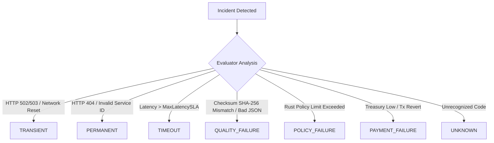

# AgentPay Failure Classification & Recovery Engine

## 1. Overview
In an autonomous multi-agent economy, failure is an inevitability: networks drop, third-party APIs experience downtime, and responses can be corrupted.
The Failure Recovery Engine classifies failures deterministically and selects the optimal recovery strategy without granting AI agents arbitrary financial authority.

---

## 2. Failure Classification Taxonomy

When an interaction fails or produces an unexpected result, `OutcomeEvaluator` classifies the incident into one of seven deterministic failure classes:

---

## 3. Recovery Strategy Decision Matrix

Based on the classification and historical evidence, the engine selects one of six structured recovery strategies:

| Failure Class | Circuit Breaker | Retries Left? | Selected Strategy | Rationale |
| :--- | :--- | :--- | :--- | :--- |
| `TRANSIENT` | HEALTHY | Yes ($< 2$) | `RETRY_SAME_SERVICE` | Temporary network blip; retry allowable. |
| `TRANSIENT` | DEGRADED | — | `TRY_ALTERNATIVE_SERVICE` | Provider failing; swap to secondary candidate. |
| `TIMEOUT` | — | — | `TRY_ALTERNATIVE_SERVICE` | SLA breached; discover alternative faster provider. |
| `QUALITY_FAILURE`| — | — | `INCREASE_VERIFICATION` | Output corrupted; enforce multi-agent verification. |
| `POLICY_FAILURE` | — | — | `REQUEST_HUMAN_APPROVAL` | Hard boundary or limit triggered; escalate to human. |
| `PERMANENT` | — | — | `TRY_ALTERNATIVE_SERVICE` | Service unavailable; discover substitute service. |
| ANY | — | Budget/Deadline Gone | `ABORT_MISSION` | Invariants prevent further financial expenditure. |

---

## 4. Execution Limits & Circuit Breakers

To prevent infinite retry spirals or budget draining attacks:
- `MAX_RETRIES_PER_HIRE = 2`: A single hire agreement can only be retried twice.
- `MAX_RECOVERY_ATTEMPTS = 3`: A mission cannot attempt more than 3 autonomous adaptations.
- Duplicate recovery payments are cryptographically prevented using deterministic correlation IDs and idempotency tokens.
