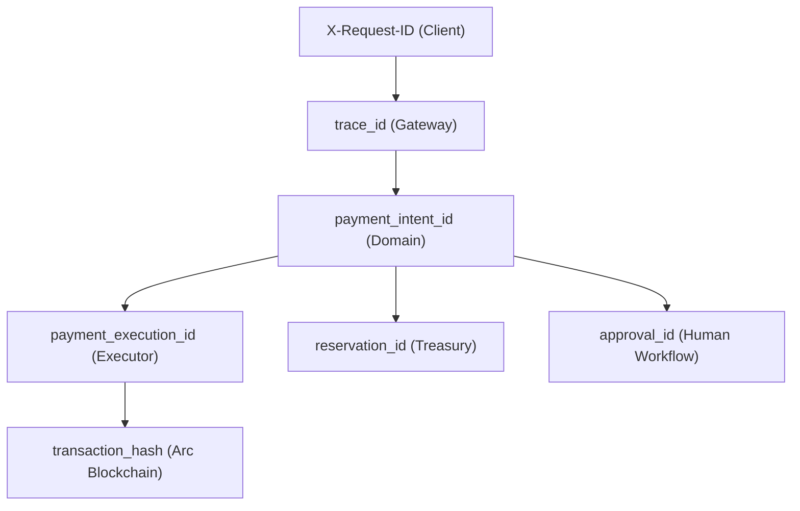

# AgentPay Financial Flight Recorder Architecture & Specification

## 1. Executive Summary & Core Principle

The AgentPay Financial Flight Recorder is **not a generic logging system**. It is a deterministic, append-only, reconstructable financial decision trail for every payment intent processed across the AgentPay platform.

### The Canonical Principle
Every payment must be explainable from beginning to end. The canonical trace follows this immutable lifecycle:

$$\text{REQUEST} \longrightarrow \text{IDENTITY} \longrightarrow \text{SERVICE} \longrightarrow \text{QUOTE} \longrightarrow \text{POLICY} \longrightarrow \text{RISK} \longrightarrow \text{APPROVAL} \longrightarrow \text{RESERVATION} \longrightarrow \text{EXECUTION} \longrightarrow \text{ARC\_TX} \longrightarrow \text{VERIFICATION} \longrightarrow \text{COMPLETION}$$

The flight recorder answers every essential financial question:
- **WHO** requested the payment? (Agent identity, organization, authentication key ID)
- **WHAT** did they request? (Integer micro-USDC amount, purpose, justification)
- **WHICH** service? (Authoritative server-side recipient address, category, capabilities)
- **WHICH** quote? (Time-bound signed quote ID, expiration timestamp)
- **WHICH** policy version? (Active integer rule matrix, limits, allowlists/blocklists)
- **WHAT** policy decision? (`ALLOW`, `DENY`, `APPROVAL_REQUIRED`)
- **WHAT** risk? (Deterministic risk score 0–100, risk level, novelty factors)
- **WHY?** (Machine-readable reason code, rule check breakdown)
- **WAS** human approval required? (Triggered by risk threshold, eligible approver role)
- **WHO** approved? (Human compliance officer ID, timestamp, approval reason)
- **WHAT** treasury reservation occurred? (Pre-allocation lock ID, vault address, amount reserved)
- **WHAT** transaction was created? (Nonce, gas parameters, safe hash)
- **WHAT** happened on Arc? (Broadcast timestamp, receipt status, block number, confirmation or timeout)
- **WHAT** was the final state? (`CONFIRMED`, `AMBIGUOUS`, `FAILED`, `DENIED`, `REJECTED`)

---

## 2. Canonical Trace Model

The canonical trace is represented by the Go domain model in [`services/gateway/internal/domain/trace.go`](file:///c:/Users/pc/OneDrive/Desktop/Arc%20micro/services/gateway/internal/domain/trace.go):

```go
type PaymentTrace struct {
    TraceID            string              `json:"trace_id"`
    OrganizationID     string              `json:"organization_id"`
    AgentID            string              `json:"agent_id"`
    PaymentIntentID    string              `json:"payment_intent_id"`
    PaymentExecutionID string              `json:"payment_execution_id,omitempty"`
    Status             string              `json:"status"`
    ExecutionMode      ExecutionMode       `json:"execution_mode"` // "LIVE" or "SIMULATION"
    CreatedAt          time.Time           `json:"created_at"`
    UpdatedAt          time.Time           `json:"updated_at"`
    Steps              []TraceStep         `json:"steps"`
    PaymentSummary     PaymentSummary      `json:"payment_summary"`
    PolicyEvidence     *PolicyEvidence     `json:"policy_evidence,omitempty"`
    ApprovalEvidence   *ApprovalEvidence   `json:"approval_evidence,omitempty"`
    TreasuryEvidence   *TreasuryEvidence   `json:"treasury_evidence,omitempty"`
    BlockchainEvidence *BlockchainEvidence `json:"blockchain_evidence,omitempty"`
}
```

### Trace Step Specification
Each discrete step in the trail contains:
- `step_number`: Monotonically increasing sequence integer ($1, 2, 3, \dots, N$) ensuring deterministic sorting independent of clock skew.
- `step_id`: Unique identifier for the audit event step.
- `trace_id`: Correlated root trace identifier.
- `type`: Stable versioned event constant.
- `status`: Step outcome (`COMPLETED`, `FAILED`, `PENDING`, `SKIPPED`, `AMBIGUOUS`).
- `timestamp`: UTC RFC3339 timestamp.
- `actor`: Normalized actor identifier (e.g. `AGENT:research-agent`, `USER:usr_compliance_01`, `SYSTEM:RUST_ENGINE`, `SYSTEM:TREASURY`).
- `correlation_id`: Root correlation/request ID linking gateway, policy engine, and blockchain executor.
- `metadata`: Sanitized, safe structured key-value pairs (zero private keys, zero API credentials).
- `reason_codes`: Machine-readable array of evaluation codes.

---

## 3. Stable Event Types & Vocabulary

AgentPay standardizes on the following canonical event vocabulary:

| Event Type | Producer | Description |
| :--- | :--- | :--- |
| `PAYMENT_REQUESTED` | Gateway HTTP API | Agent initiates a new payment intent with request parameters |
| `IDENTITY_VERIFIED` | Gateway Auth Middleware | Agent API key and Organization membership verified |
| `SERVICE_RESOLVED` | Service Registry | Service lookup verifies recipient address and pricing model |
| `QUOTE_SELECTED` | Service Registry | Validates time-bound quote ID against current service parameters |
| `POLICY_EVALUATED` | Rust Policy Engine | Pure deterministic policy decision rendered with reason code |
| `RISK_EVALUATED` | Risk Scorer | Integer risk score calculated (velocity, amount, service novelty) |
| `APPROVAL_REQUIRED` | Gateway Workflow | Policy or risk requires human compliance review |
| `PAYMENT_APPROVED` | Human Approver | Authorized officer grants payment approval |
| `PAYMENT_REJECTED` | Human Approver | Authorized officer rejects payment intent (terminal state) |
| `PAYMENT_DENIED` | Rust Policy Engine | Hard limit violation blocks execution immediately (terminal) |
| `TREASURY_RESERVED` | Treasury Manager | Off-chain allocation balance locked prior to blockchain submission |
| `TREASURY_RELEASED` | Treasury Manager | Reservation unlocked upon denial, rejection, or failure |
| `EXECUTION_STARTED` | Intent Service | Lock acquired and transaction construction commences |
| `TRANSACTION_BUILT` | Signer / Arc Client | Nonce, recipient, and calldata assembled |
| `TRANSACTION_SIGNED` | Local / KMS Signer | Transaction signed (raw signature never logged) |
| `TRANSACTION_BROADCAST` | Arc RPC Client | Transaction submitted to Arc validator mempool |
| `TRANSACTION_AMBIGUOUS` | Arc Monitor | Submission succeeded but receipt timed out; entered reconciliation |
| `TRANSACTION_CONFIRMED` | Arc Monitor | Transaction receipt verified on Arc blockchain with block number |
| `TRANSACTION_FAILED` | Arc Monitor | Transaction reverted on-chain |
| `PAYMENT_COMPLETED` | Intent Service | Treasury lock settled, agent notified, payment completed |

---

## 4. Immutability Guarantees

1. **Append-Only Storage**: The `audit_events` and `outbox_events` tables provide strict append-only semantics. No SQL `UPDATE` or `DELETE` statements are implemented or exposed anywhere in the codebase.
2. **Correction via Compensating Events**: Historical financial evidence cannot be rewritten. If an event state must be corrected or updated, a new event is appended with an incremented sequence number and explanatory reason code.
3. **No Database Modification APIs**: All external APIs provide read-only views into audit events and traces.

---

## 5. Correlation Architecture

Correlation identifiers connect operations across distributed boundaries:



The gateway propagates `X-Request-ID` down to the Rust Policy Engine via HTTP headers, preserves `IntentID` in Treasury reservation locks, passes it into `BlockchainClient` for on-chain submission, and emits it in webhook payloads.

---

## 6. Policy, Approval, Treasury & Blockchain Evidence

### 6.1 Policy Evidence
Captures the immutable output of the Rust policy engine:
- `decision`: `ALLOW`, `DENY`, `APPROVAL_REQUIRED`
- `reason_code`: e.g. `DAILY_LIMIT_EXCEEDED`, `RECIPIENT_NOT_ALLOWED`, `APPROVED`
- `risk_score`: 0–100 integer score
- `remaining_daily_limit`: Integer base units remaining
- `evaluated_at`: High-precision timestamp

### 6.2 Approval Evidence
Ensures human-in-the-loop integrity:
- **Zero Self-Approval**: Agents are strictly prohibited from approving their own payment intents (`agent_cannot_approve_payment` invariant).
- **Hard Deny Inviolability**: If the Rust policy engine issues a hard `DENY`, an approval record is never created and cannot override the decision.
- **Approver Attribution**: Records the human officer ID (`approved_by`), timestamp, and rejection reason if denied.

### 6.3 Treasury Evidence
Distinguishes between three discrete financial states:
- `RESERVED`: Balance is locked off-chain; payment has not yet executed.
- `SETTLED`: Payment confirmed on Arc; balance permanently debited.
- `RELEASED`: Execution failed or was rejected; balance returned to agent pool.

### 6.4 Blockchain Evidence
Captures verifiable on-chain facts:
- `chain_id`: `5042` (Arc Mainnet)
- `network`: `arc-mainnet` or `arc-testnet`
- `transaction_hash`: Authentic on-chain hash
- `explorer_url`: Direct link to Blockscout / Arcscan
- `status`: `CONFIRMED`, `AMBIGUOUS`, `FAILED`

---

## 7. Ambiguous Transaction Handling

When an Arc RPC receipt times out after broadcast:
1. **Never Mark as Failed**: AgentPay strictly forbids marking a timed-out transaction as `FAILED`. A timeout only means the receipt is unavailable, not that the transaction did not execute.
2. **Never Blindly Rebroadcast**: Blind rebroadcasting risks duplicate debits on Arc.
3. **Emit `TRANSACTION_AMBIGUOUS`**: The execution state is set to `AMBIGUOUS`.
4. **Reconciliation Loop**: The reconciliation worker polls the chain by transaction hash or sender nonce until the transaction is definitively confirmed or proven absent.

---

## 8. Simulation vs. Live Separation

AgentPay strictly separates simulated financial traces from live Arc settlements:

| Dimension | Live Execution (`LIVE`) | Simulation Mode (`SIMULATION`) |
| :--- | :--- | :--- |
| **Chain ID** | `5042` | `arc-simulation` |
| **Network** | `arc-mainnet` / `arc-testnet` | `simulation` |
| **Transaction Hash** | Real 32-byte hexadecimal hash | Omitted or explicitly tagged |
| **Blockchain Settlement**| Broadcast to Arc validators | **None** — strictly prohibited |
| **Explorer Link** | Verifiable Arcscan URL | **None** |
| **UI Badge** | `● LIVE ARC SETTLEMENT` (Emerald) | `⚗ SIMULATION — NO BLOCKCHAIN SETTLEMENT` (Purple) |

---

## 9. API Specification

### `GET /v1/payment-intents/{id}/trace`

Retrieves the reconstructed canonical trace.

#### Headers
```http
Authorization: Bearer <agent_or_org_api_key>
X-Organization-ID: <org_id> (Optional, inferred from token)
```

#### Response (200 OK)
```json
{
  "trace_id": "trc_intent_4418659104085444",
  "organization_id": "org_default",
  "agent_id": "research-agent",
  "payment_intent_id": "intent_4418659104085444",
  "payment_execution_id": "exec_intent_4418659104085444",
  "status": "CONFIRMED",
  "execution_mode": "LIVE",
  "created_at": "2026-09-22T00:35:10Z",
  "updated_at": "2026-09-22T00:35:12Z",
  "steps": [
    {
      "step_number": 1,
      "step_id": "step_1_intent_4418659104085444",
      "trace_id": "trc_intent_4418659104085444",
      "type": "PAYMENT_REQUESTED",
      "status": "COMPLETED",
      "timestamp": "2026-09-22T00:35:10Z",
      "actor": "AGENT:research-agent",
      "correlation_id": "req_8019b78b05da395a",
      "metadata": {
        "amount": "180000",
        "asset": "USDC",
        "service_id": "web-research"
      }
    },
    {
      "step_number": 2,
      "step_id": "step_2_intent_4418659104085444",
      "trace_id": "trc_intent_4418659104085444",
      "type": "POLICY_EVALUATED",
      "status": "COMPLETED",
      "timestamp": "2026-09-22T00:35:11Z",
      "actor": "SYSTEM:RUST_ENGINE",
      "correlation_id": "req_8019b78b05da395a",
      "metadata": {
        "decision": "ALLOW",
        "reason_code": "APPROVED"
      }
    },
    {
      "step_number": 3,
      "step_id": "step_3_intent_4418659104085444",
      "trace_id": "trc_intent_4418659104085444",
      "type": "TREASURY_RESERVED",
      "status": "COMPLETED",
      "timestamp": "2026-09-22T00:35:11Z",
      "actor": "SYSTEM:TREASURY",
      "correlation_id": "req_8019b78b05da395a",
      "metadata": {
        "amount": "180000",
        "reservation_status": "RESERVED"
      }
    },
    {
      "step_number": 4,
      "step_id": "step_4_intent_4418659104085444",
      "trace_id": "trc_intent_4418659104085444",
      "type": "TRANSACTION_CONFIRMED",
      "status": "COMPLETED",
      "timestamp": "2026-09-22T00:35:12Z",
      "actor": "SYSTEM:BLOCKCHAIN",
      "correlation_id": "req_8019b78b05da395a",
      "metadata": {
        "tx_hash": "0x3e18a28f...",
        "block_number": "104200"
      }
    },
    {
      "step_number": 5,
      "step_id": "step_5_intent_4418659104085444",
      "trace_id": "trc_intent_4418659104085444",
      "type": "PAYMENT_COMPLETED",
      "status": "COMPLETED",
      "timestamp": "2026-09-22T00:35:12Z",
      "actor": "SYSTEM",
      "correlation_id": "req_8019b78b05da395a"
    }
  ],
  "payment_summary": {
    "intent_id": "intent_4418659104085444",
    "organization_id": "org_default",
    "agent_id": "research-agent",
    "service_id": "web-research",
    "recipient": "0x1111111111111111111111111111111111111111",
    "amount": "180000",
    "asset": "USDC",
    "purpose": "api_usage"
  },
  "policy_evidence": {
    "decision": "ALLOW",
    "reason_code": "APPROVED",
    "reason": "Payment satisfies the configured policy."
  },
  "treasury_evidence": {
    "vault_address": "0x1111111111111111111111111111111111111111",
    "amount": "180000",
    "asset": "USDC",
    "status": "SETTLED"
  },
  "blockchain_evidence": {
    "chain_id": "5042",
    "network": "arc-mainnet",
    "transaction_hash": "0x3e18a28f...",
    "status": "CONFIRMED",
    "explorer_url": "https://testnet.arcscan.io/tx/0x3e18a28f..."
  }
}
```

#### Multi-Tenant Security & Isolation
Attempting to retrieve a trace belonging to another organization returns `404 Not Found` or `403 Forbidden`. Organization ID is strictly bound to the authenticated session context.

---

## 10. Webhook Decoupling Guarantee

Audit events and financial traces are stored transactionally with domain state. Webhook dispatching occurs asynchronously via the Outbox pattern. 

**Critical Invariant**: A failure or delay in external webhook delivery (e.g. endpoint down, network timeout, exhausted retries) **never rolls back or corrupts the canonical financial trace**. Payment confirmation on Arc and off-chain balance state remain 100% authoritative and intact.
