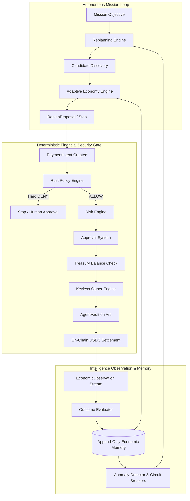

# AgentPay Intelligence Layer: Architecture Specification

## 1. Executive Summary & Objective

AgentPay is the deterministic autonomous economic control plane for AI agents on Arc.
The **Intelligence Layer** upgrades AgentPay from a static autonomous-agent economy into an **adaptive autonomous economic control plane**.

Historically, autonomous agents operating in production face common failure modes:
- A selected third-party service times out or fails during execution.
- A service unexpectedly raises prices or degrades latency.
- Counterparties fail verification checksums.
- Agent budgets or mission deadlines are exhausted due to naive static retries.

The Intelligence Layer enables the control plane to:
$$\text{OBSERVE} \longrightarrow \text{EVALUATE} \longrightarrow \text{LEARN} \longrightarrow \text{REPLAN} \longrightarrow \text{DISCOVER} \longrightarrow \text{SELECT} \longrightarrow \text{AUTHORIZE} \longrightarrow \text{EXECUTE} \longrightarrow \text{OBSERVE AGAIN}$$

---

## 2. Non-Negotiable Security Boundary

> [!IMPORTANT]
> **Fundamental Security Invariant (INV-I1):**
> The Intelligence Layer recommends what should happen next. It has **ZERO** direct financial authority.
> Existing deterministic AgentPay security controls remain absolute and authoritative.

### Prohibited Operations:
The intelligence layer MUST NOT:
- Hold private keys or sign blockchain transactions.
- Choose arbitrary or unverified payout recipients.
- Mutate `AgentVault` parameters or Treasury funds.
- Modify or disable organizational spending policies.
- Increase budgets or loosen velocity limits.
- Bypass approvals or override a deterministic `DENY`.
- Directly execute payments or alter historical audit logs.

### Authoritative Financial Pipeline:
Every proposed financial adaptation MUST re-enter the canonical AgentPay gateway pipeline:
$$\text{PaymentIntent} \longrightarrow \text{Policy Engine (Rust)} \longrightarrow \text{Risk Engine} \longrightarrow \text{Approval Gate} \longrightarrow \text{Treasury} \longrightarrow \text{Signer} \longrightarrow \text{AgentVault} \longrightarrow \text{Arc Mainnet/Sandbox}$$

---

## 3. High-Level Architecture Diagram

---

## 4. Architectural Subsystems

### 4.1 Economic Memory Store (`internal/economy/memory.go`)
- **Append-only historical ledger**: Observations are immutable once recorded. History cannot be modified to fabricate reputation scores.
- **Tenant Isolation**: Separate organization IDs prevent cross-tenant data leaks.
- **Explicit Time Windows**: Computes aggregated metrics over explicit windows:
  - `last_10_jobs`
  - `last_24_hours`
  - `last_7_days`
  - `all_time`
- **Contextual Performance**: Measures reliability and latency partitioned by specific `capability` (e.g. `data_analysis` vs `image_processing`).
- **Deterministic Math**: Pure integer math and basis-point representation ($10000 \text{ bps} = 100\%$). Floating-point arithmetic is strictly prohibited in financial paths.

### 4.2 Outcome Evaluator (`internal/economy/evaluator.go`)
- Deterministic verification of results against expected outputs.
- Checks cryptographic SHA-256 checksums, JSON schema validity, latency constraints, and error codes.
- Classifies failures into deterministic taxonomies:
  - `TRANSIENT`
  - `PERMANENT`
  - `TIMEOUT`
  - `QUALITY_FAILURE`
  - `POLICY_FAILURE`
  - `PAYMENT_FAILURE`
  - `UNKNOWN`
- Prevents LLM hallucinations from declaring success without verifiable proof.

### 4.3 Anomaly Detector & Circuit Breakers (`internal/economy/anomaly.go`)
- **Price Anomaly**: Triggers when quoted price exceeds baseline by $>200\%$.
- **Latency Anomaly**: Triggers when execution latency exceeds baseline by $>250\%$.
- **Failure Spike**: Triggers when failure rate increases by $>5000\text{ bps}$ ($>50\%$) or on consecutive failures.
- **Circuit Breaker States**:
  - `HEALTHY`: Nominal performance.
  - `DEGRADED`: Transient failures or minor latency spikes; advisory avoidance.
  - `TEMPORARILY_UNAVAILABLE`: Severe failure spikes or consecutive timeouts; service temporarily filtered from automated candidate ranking.

### 4.4 Adaptive Selection Engine (`internal/economy/engine.go`)
Extends the deterministic candidate utility calculation:
$$\text{UTILITY} = w_{\text{price}} \cdot U_{\text{price}} + w_{\text{qual}} \cdot U_{\text{qual}} + w_{\text{rel}} \cdot U_{\text{rel}} + w_{\text{ctx}} \cdot U_{\text{ctx}} + w_{\text{rep}} \cdot U_{\text{rep}} + w_{\text{lat}} \cdot U_{\text{lat}} + w_{\text{rec}} \cdot U_{\text{rec}} - w_{\text{risk}} \cdot \text{Risk}$$
- Evaluated entirely in basis points ($0 - 10000$).
- Deterministic 5-tier tie-breaking: `Score` $\to$ `Price` $\to$ `Recent Success` $\to$ `Latency` $\to$ `Service ID (lexicographical)`.

### 4.5 Replanning Engine (`internal/economy/replanning.go`)
- Generates structured, immutable `ReplanProposal` objects when steps fail.
- Evaluates multi-strategy recovery:
  - `RETRY_SAME_SERVICE` (for transient failures with remaining retries)
  - `TRY_ALTERNATIVE_SERVICE` (when degraded or better alternative candidate exists)
  - `REDUCE_SCOPE` (when budget or deadline is tight)
  - `REQUEST_HUMAN_APPROVAL` (when confidence is low or policy flags high risk)
  - `ABORT_MISSION` (when budget or execution limits are exhausted)
- Budget-aware: Never proposes candidate steps exceeding remaining unencumbered budget.
- Deadline-aware: Enforces a $20\%$ latency safety margin against remaining mission execution deadlines.

### 4.6 Safety Limits & Loop Prevention
To guarantee that recursive autonomous loops terminate deterministically:
- `MAX_MISSION_ITERATIONS = 10`
- `MAX_RECOVERY_ATTEMPTS = 3`
- `MAX_REPLAN_COUNT = 3`
- `MAX_RETRIES_PER_HIRE = 2`
If any boundary is exceeded, the mission transitions immediately to `FAILED` or `BUDGET_EXHAUSTED` with structured failure audit logs.
