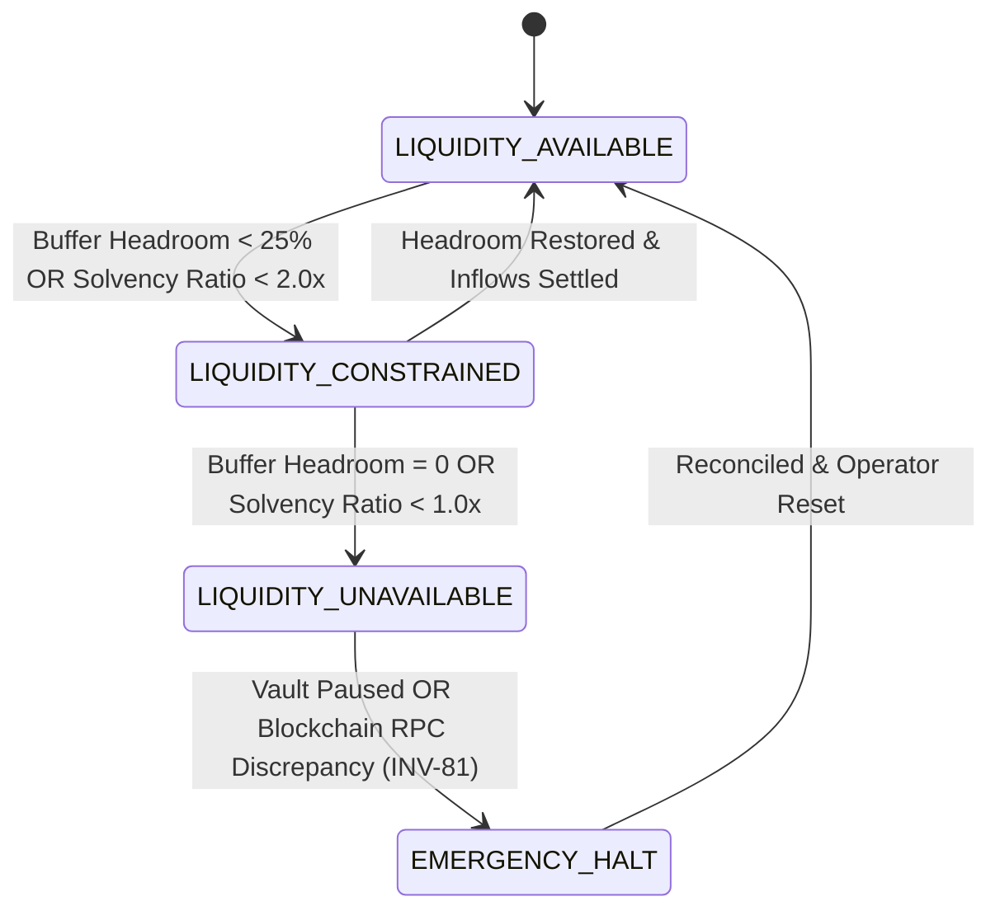

# Hierarchical Liquidity & Multi-Tier Balance Model

## 1. Executive Summary

In AgentPay, capital is not treated as a monolithic float. Because autonomous AI agents execute tasks asynchronously, parallel swarm operations can quickly trigger race conditions, sudden overdrafts, and systemic capital starvation if liquidity is managed naively.

The Autonomous Treasury and Liquidity Orchestrator (Task 11) introduces a formal, mathematically verified **Hierarchical Liquidity Model** governed by:
```
Total Capital = Available Unencumbered + Reserved Active + Committed (Hard/Soft) + Safety Buffer Floor
```

---

## 2. Multi-Tier Balance Definitions

| Balance Component | Type | Definition | Invariant Guard |
| :--- | :--- | :--- | :--- |
| **`Total Balance`** | On-Chain / Ledger | The absolute sum of all assets under management within the AgentVault. | Machine-checked via `INV-71` |
| **`Safety Buffer Floor`** | System Constraint | Immovable capital reservation required to prevent catastrophic insolvency. | Strictly preserved via `INV-72` |
| **`Reserved Balance`** | In-Flight Encumbrance | Funds temporarily locked for pending missions, swarms, or obligations. | Atomic allocation via `INV-75` |
| **`Committed Balance`** | Future Obligations | Sum of hard (escrow-bound) and soft (estimated pipeline) payment commitments. | Tracked via `INV-78` |
| **`Available Unencumbered`**| Spendable Headroom | `Total Balance - Reserved Balance - Safety Buffer`. | Non-negative via `INV-71` |
| **`Safe Capacity`** | Commitment Room | The absolute maximum liquidity that may be reserved without breaching the safety buffer. | `Available - Buffer Floor` |

---

## 3. Operational Mode State Machine

The orchestrator dynamically transitions across 4 operational modes based on real-time solvency ratios and buffer headroom:



### Operational Modes Explained
1. **`LIQUIDITY_AVAILABLE`**: All agent requests, reservations, and settlements execute without throttling.
2. **`LIQUIDITY_CONSTRAINED`**: Low-priority background missions are deferred; priority boost is applied to starved tasks (starvation prevention).
3. **`LIQUIDITY_UNAVAILABLE`**: No new reservations are granted; existing reservations execute to terminal state.
4. **`EMERGENCY_HALT`**: Triggered immediately upon detected on-chain discrepancy (`INV-81`), AgentVault pause (`INV-83`), or concentration spike (`INV-84`).

---

## 4. Priority Allocation & Starvation Prevention

When liquidity is constrained, the `LiquidityAllocator` calculates priority using deterministic scoring:
```
Priority Score = BasePriority (0-10) + (DeferralCount * 10) + (WaitDurationHours > 2 ? 15 : 0)
```
- **Starvation Avoidance Guarantee**: Any deferred mission accumulates priority exponentially, guaranteeing that long-waiting background tasks are not perpetually starved by newly arriving high-priority tasks.
- **Fair Share Envelope**: No individual agent or swarm cluster may encumber greater than 60% of total unencumbered headroom without triggering concentration anomaly alarms.

---

## 5. Architectural Non-Bypass Guarantee (`INV-85`)

> **CORE PRINCIPLE**: *"Treasury intelligence can plan. Treasury controls can constrain. Only the existing execution pipeline can move money."*

The Treasury Orchestrator contains **ZERO wallet abstractions**, **ZERO private keys**, and **ZERO transaction signing logic**. It operates strictly as an economic governor:
1. Agent requests reservation $\to$ Orchestrator verifies safe headroom.
2. Reservation granted atomically $\to$ Downstream policy engine evaluates rules.
3. Execution Gateway dispatches settlement $\to$ AgentVault moves USDC on Arc.
4. Downstream receipt confirmed $\to$ Reservation consumed or released.
