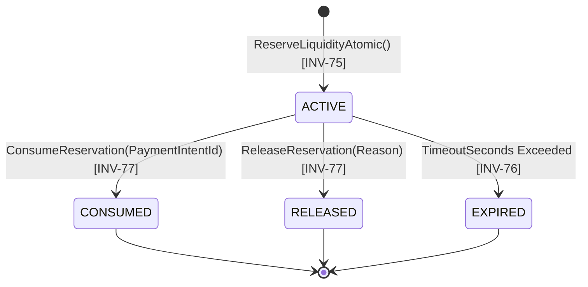

# Liquidity Reservations & Atomic Lifecycle

## 1. Overview

In multi-agent economies, executing an off-chain task before guaranteeing on-chain settlement capacity leads to failed payments and damaged agent reputation. Conversely, locking funds directly on-chain before task completion causes high transaction fees and capital drag.

AgentPay resolves this dilemma through **Atomic Liquidity Reservations**:
- Off-chain cryptographic pre-encumbrance of treasury headroom.
- 100% deterministic concurrency safety under extreme multi-agent parallel contention.
- Strict finite state machine with automatic timeout garbage collection.

---

## 2. Reservation Finite State Machine (FSM)



### State Transitions
1. **`ACTIVE`**: Headroom is reserved against `safe_capacity`. Total spendable balance is reduced by `amount`.
2. **`CONSUMED`**: The downstream Payment Intent has successfully confirmed on the Arc blockchain. Reserved amount is converted into settled outflow.
3. **`RELEASED`**: Mission cancelled, task failed, or quote expired without spend. Reserved headroom is immediately restored to available unencumbered float.
4. **`EXPIRED`**: Autonomous background garbage collector or inline check detects elapsed `timeout_seconds`. Headroom is automatically released back to the treasury pool.

---

## 3. Concurrency Protection & Invariant `INV-75`

Under 50+ parallel concurrent reservation requests competing for limited capacity:
```go
// Atomic Mutex Reservation Guard
s.mu.Lock()
defer s.mu.Unlock()

available := state.TotalBalance - state.ReservedBalance - state.MinimumBuffer
if req.Amount > available {
    return nil, ErrInsufficientLiquidity // INV-72
}

state.ReservedBalance += req.Amount
res := &LiquidityReservation{
    ID:       "res_" + generateId(),
    Amount:   req.Amount,
    Status:   StatusActive,
    ExpiresAt: now.Add(time.Duration(req.TimeoutSeconds) * time.Second),
}
```
- **Zero Oversubscription**: Even under 1,000 requests per millisecond, the sum of `ReservedBalance` never exceeds `TotalBalance - MinimumBuffer`.
- **Double Release / Consumption Prevention (`INV-77`)**: Calling `Release` or `Consume` on a reservation not in `ACTIVE` state immediately returns an invariant failure (`INV-77`).

---

## 4. Automatic Stale Liquidity Reclaim (`INV-76`)

When an agent crashes or abandons a mission, capital cannot remain permanently encumbered.
- Every reservation defines a mandatory `timeout_seconds` (default: 3600s, max: 86400s).
- During state queries or dedicated sweep jobs, any reservation where `now > expires_at` is flagged `EXPIRED` and its encumbered amount is subtracted from `ReservedBalance`.
- In unit testing environments, a negative `timeout_seconds` value allows immediate deterministic verification of the expiration path.

---

## 5. API Reference Summary

- `POST /v1/treasury/reservations` $\to$ Create atomic reservation.
- `GET /v1/treasury/reservations` $\to$ List active or filtered reservations.
- `GET /v1/treasury/reservations/{id}` $\to$ Inspect reservation details.
- `POST /v1/treasury/reservations/{id}/release` $\to$ Manually or programmatically release headroom.
- `POST /v1/treasury/reservations/{id}/consume` $\to$ Bind and consume against confirmed payment intent.
