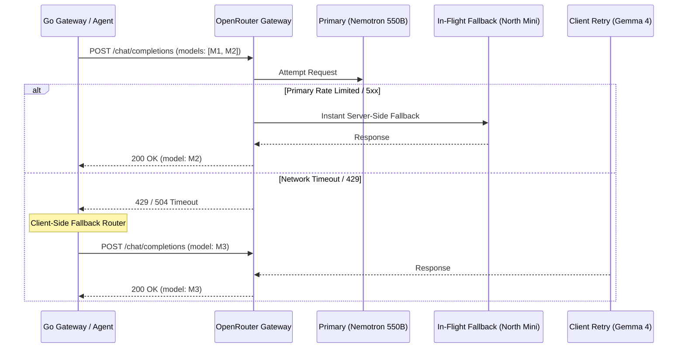

# OpenRouter Integration Guide — AgentPay Universal AI Layer

## 1. Overview

AgentPay uses **OpenRouter** as the unified gateway for all AI reasoning operations. OpenRouter provides access to a diverse catalog of frontier and open-weights models through a single API key and an OpenAI-compatible interface, eliminating vendor lock-in and allowing resilient model routing with automatic fallbacks.

---

## 2. Configuration & Environment Variables

The AI Provider Layer is configured via environment variables in the Gateway and Python Agent:

| Variable | Type | Default | Description |
| :--- | :--- | :--- | :--- |
| `AI_PROVIDER` | string | `openrouter` | Active provider (`openrouter`, `mock`). Automatically set to `openrouter` when `OPENROUTER_API_KEY` is present. |
| `OPENROUTER_API_KEY` | string | *(secret)* | OpenRouter authentication key (`sk-or-v1-...`). Redacted in all logs and telemetry. |
| `AI_MODEL` | string | `nvidia/nemotron-3-ultra-550b-a55b:free` | Default primary reasoning model for general tasks. |
| `OPENROUTER_BASE_URL`| string | `https://openrouter.ai/api/v1` | OpenRouter REST API endpoint. |
| `AI_TIMEOUT_SECONDS` | int | `30` | Per-request HTTP timeout before triggering client-side fallback. |

### Security Invariant
> [!IMPORTANT]
> The `OPENROUTER_API_KEY` is strictly a backend secret. It is **never** prefixed with `NEXT_PUBLIC_` and is never shipped in browser bundles. The frontend interacts only with authenticated Gateway endpoints (`/control/ai/*`).

---

## 3. Configured Model Pool

AgentPay leverages top-performing models available on OpenRouter, with specialized routing based on task domain:

### Primary Model
- **`nvidia/nemotron-3-ultra-550b-a55b:free`**:
  550B parameter powerhouse optimized for complex multi-step reasoning, intent decomposition, and structured schema adherence.

### Fallback & Specialized Models
1. **`cohere/north-mini-code:free`**:
   Specialized code and structured JSON generation; ultra-fast latency for real-time replanning and marketplace filtering.
2. **`google/gemma-4-31b-it:free`**:
   State-of-the-art instruction-tuned model for deep contextual analysis and anomaly explanations.
3. **`poolside/laguna-s-2.1:free`**:
   High-precision planning model for long-horizon mission decomposition and stage dependency mapping.
4. **`inclusionai/ling-3.0-flash-fin:free`**:
   Finance-specialized flash model for merchant negotiation, price benchmarking, and risk factor extraction.

---

## 4. Two-Tier Resilient Fallback Architecture

To ensure high availability and zero operational disruption, AgentPay implements two tiers of model failover:



### 1. Server-Side Fallback Array
Requests sent to OpenRouter specify a primary model and an ordered list of fallback models directly in the request payload:
```json
{
  "model": "nvidia/nemotron-3-ultra-550b-a55b:free",
  "models": [
    "nvidia/nemotron-3-ultra-550b-a55b:free",
    "cohere/north-mini-code:free",
    "google/gemma-4-31b-it:free"
  ],
  "response_format": { "type": "json_object" }
}
```

### 2. Client-Side Fallback Circuit
If OpenRouter itself returns a rate-limit (429) or transient error, the Gateway's `Service` catches the error and immediately dispatches to the next fallback candidate defined in `routing.Router`.

---

## 5. Telemetry, Tracing & Masking

All AI requests pass through `internal/ai/observability/tracer.go`:
- **Latency & Token Metrics**: Prompt tokens, completion tokens, latency (ms), and cost in micro-USDC are recorded per request.
- **Ring-Buffer Storage**: In-memory ring buffer (last 1,000 requests) prevents unbounded memory growth.
- **Automatic Secret Sanitization**:
  Any pattern matching `sk-or-v1-...`, `0x[a-fA-F0-9]{64}`, or `AI_API_KEY` is replaced with `[REDACTED_SECRET]` before telemetry storage or logging.
- **Monitoring Endpoint**: Exposed at `GET /control/ai/telemetry` for the operator dashboard.
