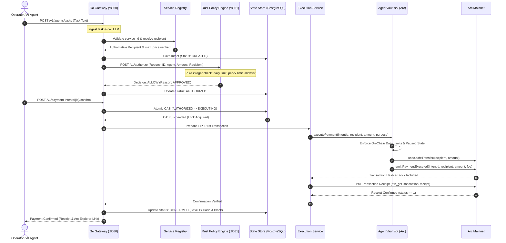
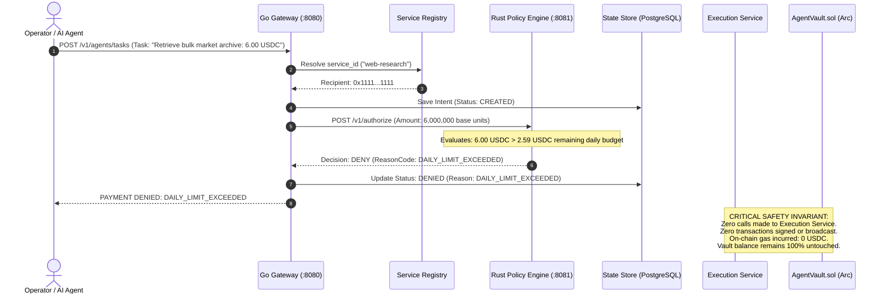

# AgentPay Payment & Denial Flow

> **Specification**: Complete Sequence of Successful Settlement and Safety Denial  
> **Components**: AI Agent, Service Registry, Go Gateway, Rust Policy Engine, AgentVault, Arc Mainnet

This document illustrates the execution lifecycle of payment intents under both normal operation (Happy Path) and safety policy rejection (Denial Path).

---

## 1. Happy Path Sequence: Authorized Payment & On-Chain Settlement

---

## 2. Safety Denial Path Sequence: Policy Rejection (No Transaction)

The denial path is an essential safety feature of AgentPay: it proves that the system is not merely a payment forwarder, but a deterministic security firewall that blocks unauthorized capital movement before touching the blockchain.

---

## 3. Key Differences Between Flows

| Dimension | Happy Path | Denial Path |
|---|---|---|
| **AI Intent Status** | `CREATED` $\rightarrow$ `AUTHORIZED` $\rightarrow$ `EXECUTING` $\rightarrow$ `CONFIRMED` | `CREATED` $\rightarrow$ `DENIED` (Terminal) |
| **Rust Policy Decision** | `ALLOW` (`APPROVED`) | `DENY` (`DAILY_LIMIT_EXCEEDED` / `RECIPIENT_BLOCKED`) |
| **Execution Call** | Dispatched to `AgentVault.executePayment()` | **Aborted** prior to execution boundary |
| **Blockchain Transaction** | Confirmed on Arc (e.g., EIP-1559 receipt) | **NONE** |
| **Gas Fee Incurred** | Standard Arc USDC gas fee | **0 USDC** |
| **On-Chain Vault State** | Daily spending counter incremented | **Untouched** |
