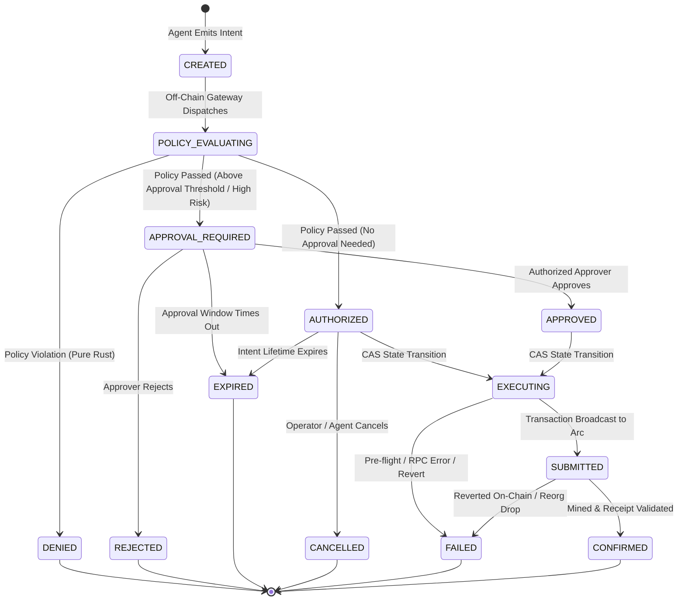

# AgentPay Payment Lifecycle V2

## 1. State Machine Definition

In AgentPay V2, the payment lifecycle is extended to support asynchronous policy evaluation, risk classification, and human approval workflows without compromising off-chain determinism or on-chain settlement integrity.



---

## 2. Comprehensive State Matrix

| State | Type | Description |
| :--- | :--- | :--- |
| `CREATED` | Initial | Intent has been ingested and persisted with an idempotency key. No policy checks run yet. |
| `POLICY_EVALUATING` | Transient | Intent is currently being evaluated by the Rust Policy Engine and Risk Layer. |
| `AUTHORIZED` | Pre-Execution | Rust policy evaluation succeeded. Amount is below human approval threshold. Ready for execution. |
| `APPROVAL_REQUIRED` | Pending Gate | Policy passed, but payment amount $\ge$ `approval_threshold` or risk level is `HIGH`. Awaits human approver. |
| `APPROVED` | Pre-Execution | Designated human approver signed off on the payment. Ready for execution. |
| `EXECUTING` | Active | Backend executor holds the atomic CAS lock and is signing/broadcasting the transaction to Arc. |
| `SUBMITTED` | In-Flight | Transaction has been broadcast to Arc Mainnet; transaction hash exists; awaiting mining and confirmation. |
| `CONFIRMED` | **Terminal** | Transaction has been mined, `PaymentExecuted` event verified, and USDC transfer confirmed on Arc. |
| `DENIED` | **Terminal** | Rust Policy Engine rejected the request due to policy violation (e.g. limit exceeded, blocked recipient). |
| `REJECTED` | **Terminal** | Human approver explicitly rejected the payment request. Zero blockchain interaction. |
| `EXPIRED` | **Terminal** | Intent or approval request timed out before confirmation or execution. |
| `CANCELLED` | **Terminal** | Operator or agent explicitly cancelled the intent prior to `EXECUTING`. |
| `FAILED` | **Terminal** | Blockchain execution failed (e.g. RPC rejection, EVM revert, or gas exhaustion). |

---

## 3. Transition Rules & Authorization Matrix

| Transition | Allowed? | Triggered By | Prerequisite Conditions |
| :--- | :---: | :--- | :--- |
| `CREATED` $\rightarrow$ `POLICY_EVALUATING` | ✅ | System (Gateway) | Valid schema, valid `agent_id` and `service_id`. |
| `POLICY_EVALUATING` $\rightarrow$ `AUTHORIZED` | ✅ | Rust Policy Engine | Decision `ALLOW`, `requires_approval = false`. |
| `POLICY_EVALUATING` $\rightarrow$ `APPROVAL_REQUIRED` | ✅ | Rust Policy Engine | Decision `ALLOW`, `amount >= approval_threshold` or `risk = HIGH`. |
| `POLICY_EVALUATING` $\rightarrow$ `DENIED` | ✅ | Rust Policy Engine | Decision `DENY` (with explicit reason code). |
| `APPROVAL_REQUIRED` $\rightarrow$ `APPROVED` | ✅ | Human Approver | User with `APPROVER` role calls `/approve`. |
| `APPROVAL_REQUIRED` $\rightarrow$ `REJECTED` | ✅ | Human Approver | User with `APPROVER` role calls `/reject`. |
| `APPROVAL_REQUIRED` $\rightarrow$ `EXPIRED` | ✅ | System Cron / Timer | `NOW() > expires_at`. |
| `AUTHORIZED` $\rightarrow$ `EXECUTING` | ✅ | Executor Service | Atomic CAS: `UPDATE ... WHERE status = 'AUTHORIZED'`. |
| `APPROVED` $\rightarrow$ `EXECUTING` | ✅ | Executor Service | Atomic CAS: `UPDATE ... WHERE status = 'APPROVED'`. |
| `AUTHORIZED` $\rightarrow$ `CANCELLED` | ✅ | Operator / Agent | Request signed by authorized agent or operator before execution. |
| `AUTHORIZED` $\rightarrow$ `EXPIRED` | ✅ | System Cron / Timer | `NOW() > expires_at`. |
| `EXECUTING` $\rightarrow$ `SUBMITTED` | ✅ | Executor Service | `eth_sendRawTransaction` returns valid `tx_hash`. |
| `EXECUTING` $\rightarrow$ `FAILED` | ✅ | Executor Service | Pre-flight check fails, nonce error, or RPC rejected. |
| `SUBMITTED` $\rightarrow$ `CONFIRMED` | ✅ | Reconciliation Worker | Receipt status `0x1` and `PaymentExecuted` event parsed. |
| `SUBMITTED` $\rightarrow$ `FAILED` | ✅ | Reconciliation Worker | Receipt status `0x0` (revert) or transaction dropped/replaced. |

### Invalid Transitions (Strictly Rejected)
- `DENIED` $\rightarrow$ Any State (Denial is irreversible).
- `CONFIRMED` $\rightarrow$ Any State (Settlement on Arc is immutable).
- `FAILED` $\rightarrow$ `EXECUTING` (Failed intents must NOT be re-executed under the same intent ID; a new intent must be emitted).
- `CREATED` $\rightarrow$ `EXECUTING` (Bypassing policy evaluation is physically impossible).
- `APPROVAL_REQUIRED` $\rightarrow$ `EXECUTING` (Bypassing human approval is prohibited).

---

## 4. Concurrency & Idempotency Controls

### Atomic Compare-And-Swap (CAS)
Double-spending and race conditions are eliminated using atomic database transitions:
```sql
UPDATE payment_intents
SET status = 'EXECUTING', updated_at = NOW()
WHERE id = $1 AND status IN ('AUTHORIZED', 'APPROVED')
RETURNING id;
```
If zero rows are updated, another execution thread has already acquired the lock or the intent is no longer in an executable state. The duplicate request fails closed with HTTP 409 Conflict.

### Idempotency Key Enforcing
Every intent submission requires an `Idempotency-Key` header or payload field:
1. If the key exists and matches an existing intent with the same agent and payload, the gateway returns the existing intent status and execution record.
2. If the key exists with conflicting payload parameters, the gateway returns HTTP 422 Unprocessable Entity.

---

## 5. Blockchain Ambiguity & Failure Recovery

When interacting with Arc Mainnet, network latency, dropped RPC sockets, or node timeouts can create ambiguous states where the gateway does not know if a transaction was mined.

AgentPay V2 handles blockchain ambiguity with strict safety rules:

1. **Never Re-broadcast on Ambiguity**: If `eth_sendRawTransaction` times out, the intent remains in `SUBMITTED` with its known `transaction_hash`. The executor **never** signs a new transaction with a new nonce, preventing double-payment.
2. **Reconciliation Worker**: A dedicated background process polls `eth_getTransactionReceipt(txHash)` on Arc with exponential backoff:
   - If receipt status is `1` and contains `PaymentExecuted`: transitions to `CONFIRMED`.
   - If receipt status is `0` (revert): transitions to `FAILED` with on-chain revert reason.
   - If transaction is not mined after 60 blocks (~60 seconds on Arc): alerts operators via webhook for manual reconciliation.
3. **Reorg Protection**: While Arc's deterministic consensus provides fast finality, the reconciliation worker waits for 2 block confirmations before emitting the final `payment.confirmed` webhook.
