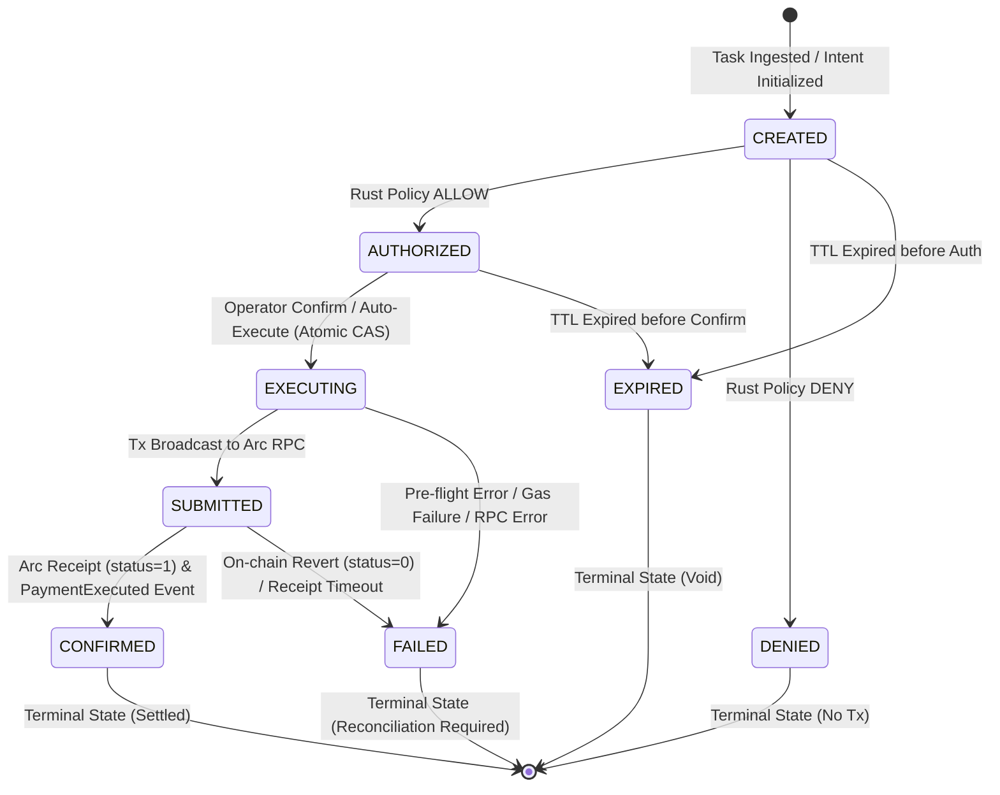

# AgentPay Payment Intent State Machine

> **Specification Version**: 1.0.0  
> **Component**: Gateway Intent Service (`services/gateway/internal/intent`)  
> **Storage Layer**: PostgreSQL / In-Memory Repository with Atomic Compare-And-Swap (CAS)

This document formalizes the complete lifecycle, state transitions, concurrency protections, and recovery mechanisms for Payment Intents in AgentPay.

---

## 1. State Machine Overview

A Payment Intent represents an autonomous agent's request to spend USDC. To prevent double-spending, replay attacks, and unauthorized execution, every intent transitions through a strict, deterministic finite state machine (FSM).



---

## 2. State Definitions

| State | Category | Description | Permitted Next States |
|---|---|---|---|
| `CREATED` | Active | Initial intent created by AI agent or user request against an approved service in the Service Registry. | `AUTHORIZED`, `DENIED`, `EXPIRED` |
| `AUTHORIZED` | Active | Evaluated and approved by the Rust Policy Engine. Ready for operator confirmation or auto-execution. | `EXECUTING`, `EXPIRED` |
| `EXECUTING` | In-Flight | Locked via atomic Compare-And-Swap (CAS). The execution service is assembling, signing, or broadcasting the transaction. | `SUBMITTED`, `FAILED` |
| `SUBMITTED` | In-Flight | The raw EIP-1559 transaction has been broadcast to Arc Mainnet; waiting for block inclusion and receipt confirmation. | `CONFIRMED`, `FAILED` |
| `CONFIRMED` | **Terminal** | Transaction confirmed on Arc (`status == 1`) and `PaymentExecuted` event emitted. | *None* (Terminal / Idempotent) |
| `DENIED` | **Terminal** | Rejected by the Rust Policy Engine (e.g. `DAILY_LIMIT_EXCEEDED`, `RECIPIENT_BLOCKED`). | *None* (Terminal / Zero Tx) |
| `FAILED` | **Terminal** | Execution failed due to network error, RPC timeout, insufficient gas, or on-chain revert. | *None* (Terminal / Reconciliation) |
| `EXPIRED` | **Terminal** | The intent was not authorized or confirmed within the configured Time-To-Live (TTL). | *None* (Terminal / Void) |

---

## 3. Transition Invariants & Guardrails

The state machine enforces strict invariants via `ValidateTransition(from, to IntentStatus)`:

### 1. Prohibited Illegal Transitions
- **`DENIED` $\rightarrow$ `EXECUTING`**: **IMPOSSIBLE**. A denied intent can never be submitted to the execution service or touch the blockchain.
- **`EXPIRED` $\rightarrow$ `EXECUTING`**: **IMPOSSIBLE**. Expired intents are voided; any execution attempt triggers `ErrIntentExpired`.
- **`CONFIRMED` $\rightarrow$ `EXECUTING`**: **IMPOSSIBLE**. An already settled payment cannot be re-executed, preventing replay attacks.
- **`FAILED` $\rightarrow$ `CONFIRMED`**: **IMPOSSIBLE**. A failed execution cannot transition to confirmed without an explicit, auditable transaction reconciliation record.

### 2. Idempotent Confirmation
If `ConfirmIntent` is invoked on an intent that is already `CONFIRMED`:
- The service returns the existing execution record with its original transaction hash and receipt details.
- **Zero new transactions are broadcast to Arc.**

---

## 4. Double-Spend & Concurrency Defense: Atomic CAS

To prevent race conditions—such as double-clicking in the UI, parallel API invocations, or distributed workers attempting to execute the same intent simultaneously—the transition from `AUTHORIZED` to `EXECUTING` uses **Atomic Compare-And-Swap (CAS)**:

```sql
UPDATE payment_intents 
SET status = 'EXECUTING', updated_at = $1 
WHERE intent_id = $2 AND status = 'AUTHORIZED';
```

### Race Resolution Flow
```
Worker A                                      Worker B
   │                                             │
   ├─► CAS (AUTHORIZED -> EXECUTING)             │
   │   Result: SUCCESS (1 row updated)           │
   │                                             ├─► CAS (AUTHORIZED -> EXECUTING)
   ├─► Proceeds to Sign & Broadcast              │   Result: FAILED (0 rows updated)
   │                                             │
   │                                             ├─► Re-checks State: Status is EXECUTING
   │                                             │   Returns: ErrAlreadyExecuting
   ▼                                             ▼
Broadcast to Arc                              Terminates Gracefully (No Tx)
```

1. Only the single worker that successfully updates the row from `AUTHORIZED` to `EXECUTING` acquires execution authority.
2. Any competing worker receives `swapped = false`.
3. The competing worker re-checks the state; if the intent is in `EXECUTING`, it returns `ErrAlreadyExecuting`; if already `CONFIRMED`, it returns the existing confirmation idempotently.

---

## 5. Ambiguity Handling & Failure Modes

When an off-chain gateway submits transactions to a blockchain, network partitions or RPC timeouts can cause execution ambiguity. AgentPay enforces fail-closed handling:

1. **RPC Timeout during Broadcast**:
   - The intent remains locked or transitions to `FAILED` with an explicit reason (`RPC_TIMEOUT`).
   - **No blind retries**: The gateway NEVER immediately submits a new transaction with a new nonce, as doing so could result in double-spending if the original transaction is mined.
2. **Transaction Reconciliation**:
   - The operator inspects the transaction record via `/transactions` or Arc Explorer.
   - If mined, the status is reconciled to `CONFIRMED`; if dropped from the mempool, the intent is re-evaluated by policy before any re-submission.
