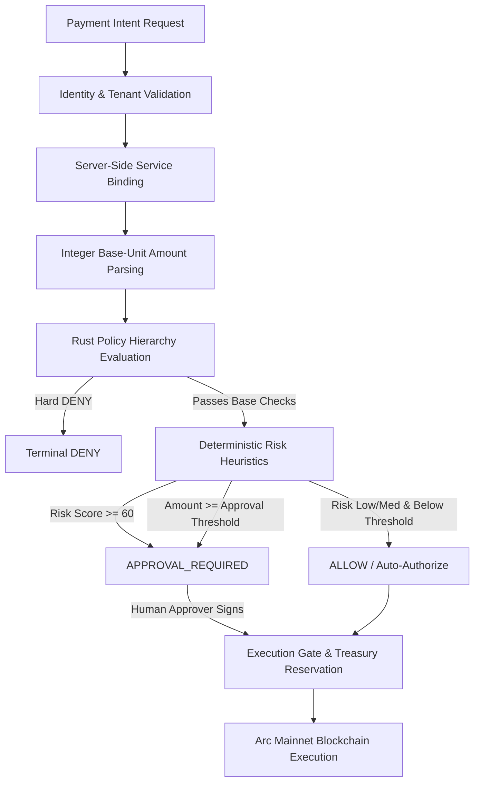

# AgentPay Deterministic Policy Engine Specification

## 1. Core Architecture & Philosophy

The AgentPay Policy Engine (`services/policy-engine`) serves as the deterministic, mathematical financial control plane of the AgentPay platform. Implemented in pure Rust, it evaluates payment authorization requests against layered security policies without reliance on probabilistic LLM reasoning, network lookups, floating-point arithmetic, or mutable side effects.

### Guiding Principles

1. **Agent Intelligence Proposes — AgentPay Policy Decides**: Autonomous agents (LLM reasoning loops) can discover services, request quotes, and formulate payment intents. However, they possess **zero** financial authority to self-authorize payments, modify limits, or adjust risk parameters.
2. **Deterministic Evaluation**: Given identical request metadata, policy configuration, and risk context, the engine returns bit-for-bit identical outputs across every invocation.
3. **Fail-Closed by Construction**: Any error, missing policy, unparseable address, integer overflow condition, or unhandled enum branch results in immediate `DENY`.
4. **Hard DENY Inviolability**: A hard policy `DENY` is absolute and terminal. Human operators cannot approve a payment that violates a hard policy rule (e.g. blocked recipient, spending limit exceeded, paused tenant).
5. **Zero Floating-Point Math**: All amounts, limits, velocity bounds, and risk points are calculated strictly in integer base units (`u64` in Rust, atomic cents/wei).

---

## 2. Decision Pipeline & Lifecycle

The financial authorization flow follows a unidirectional security pipeline:



---

## 3. Policy Dimensions

The policy system models 16 distinct dimensions:

| Dimension | Scope | Enforcement Mechanism |
| :--- | :--- | :--- |
| **1. Agent Enabled/Disabled** | Agent | `policy.enabled == false` $\rightarrow$ `DENY(POLICY_DISABLED)` |
| **2. Organization Enabled/Disabled** | Org | `policy.organization_paused == true` $\rightarrow$ `DENY(ORGANIZATION_PAUSED)` |
| **3. Global Emergency Pause** | Global | `policy.global_paused == true` $\rightarrow$ `DENY(GLOBAL_PAUSED)` |
| **4. Per-Transaction Limit** | Agent/Org | `amount > per_transaction_limit` $\rightarrow$ `DENY(AMOUNT_EXCEEDS_TRANSACTION_LIMIT)` |
| **5. Agent Daily Budget** | Agent | `daily_spent + amount > daily_limit` $\rightarrow$ `DENY(DAILY_LIMIT_EXCEEDED)` |
| **6. Organization Daily Budget** | Org | Aggregated cap across all agents in tenant |
| **7. Service Allowlist** | Agent/Org | `allowed_services` populated & `service_id` missing $\rightarrow$ `DENY(SERVICE_NOT_ALLOWED)` |
| **8. Service Blocklist** | Agent/Org | `blocked_services` contains `service_id` $\rightarrow$ `DENY(SERVICE_BLOCKED)` |
| **9. Recipient Allowlist** | Agent/Org | `allowed_recipients` set & `recipient` missing $\rightarrow$ `DENY(RECIPIENT_NOT_ALLOWED)` |
| **10. Recipient Blocklist** | Agent/Org | `blocked_recipients` contains `recipient` $\rightarrow$ `DENY(RECIPIENT_BLOCKED)` |
| **11. Asset Allowlist** | Agent/Org | `allowed_assets` does not contain `asset` $\rightarrow$ `DENY(ASSET_NOT_ALLOWED)` |
| **12. Asset Blocklist** | Agent/Org | `blocked_assets` contains `asset` $\rightarrow$ `DENY(ASSET_BLOCKED)` |
| **13. Transaction Count Limit** | Agent | `daily_transaction_count >= max_transactions_per_day` $\rightarrow$ `DENY` |
| **14. Daily Velocity** | Agent | Rate of budget depletion and transaction bursts |
| **15. Hourly Velocity** | Agent | `hourly_spent + amount > hourly_limit` $\rightarrow$ `DENY(HOURLY_VELOCITY_EXCEEDED)` |
| **16. Approval Threshold** | Agent/Org | `amount >= approval_threshold` $\rightarrow$ `APPROVAL_REQUIRED` |

---

## 4. Policy Hierarchy & Composition

Policies are layered according to strict hierarchical precedence:

$$\text{GLOBAL} \longrightarrow \text{ORGANIZATION} \longrightarrow \text{AGENT} \longrightarrow \text{SERVICE}$$

When composing policies (`compose_policies(org, agent)`):
1. **Pauses Prevail**: If either Org or Agent is paused or disabled, the composed policy is disabled/paused.
2. **Numeric Limits Tighten**: $\text{Limit}_{\text{composite}} = \min(\text{Limit}_{\text{org}}, \text{Limit}_{\text{agent}})$. Stricter limits always override looser limits.
3. **Allowlists Intersect**: An asset, service, or recipient must be permitted by BOTH levels:
   $$\text{Allowed}_{\text{composite}} = \text{Allowed}_{\text{org}} \cap \text{Allowed}_{\text{agent}}$$
4. **Blocklists Union**: If either level blocks an asset, service, or recipient, it is blocked in the composite:
   $$\text{Blocked}_{\text{composite}} = \text{Blocked}_{\text{org}} \cup \text{Blocked}_{\text{agent}}$$

---

## 5. Explainable Decision Model

Every policy evaluation emits structured explainability telemetry via `Vec<RuleCheck>`:

```json
{
  "request_id": "req_019283",
  "decision": "ALLOW",
  "reason_code": "APPROVED",
  "reason": "Payment satisfies the configured policy.",
  "policy_id": "pol_agent_research_01",
  "policy_version": "v1.0.0",
  "risk_level": "LOW",
  "risk_score": 10,
  "checks": [
    {"rule": "policy_enabled", "passed": true, "message": "Policy is active and not paused."},
    {"rule": "valid_amount", "passed": true, "message": "Amount is positive non-zero."},
    {"rule": "allowed_asset", "passed": true, "message": "Asset USDC is permitted."},
    {"rule": "recipient_blocked", "passed": true, "message": "Recipient is not on blocklist."},
    {"rule": "per_transaction_limit", "passed": true, "message": "Amount 250000 <= limit 500000."},
    {"rule": "daily_spending_limit", "passed": true, "message": "Total daily spent 1250000 <= limit 5000000."},
    {"rule": "risk_service_novelty", "passed": true, "message": "Service familiarity (prior txs: 8): +0 pts"}
  ],
  "remaining_daily_limit": 3750000,
  "simulation": false
}
```

---

## 6. Integer Arithmetic & Overflow Safety

All mathematical calculations in the policy engine use safe arithmetic operations:
- `saturating_add`
- `checked_add`
- Safe integer comparison for ratios (e.g., $A \times 100 \ge B \times 85$ instead of $A / B \ge 0.85$, avoiding floating-point rounding and division-by-zero errors).

Under test conditions where amounts reach `u64::MAX`, the policy engine executes without panics and rejects the payment deterministically via `AMOUNT_EXCEEDS_TRANSACTION_LIMIT` or `DAILY_LIMIT_EXCEEDED`.
