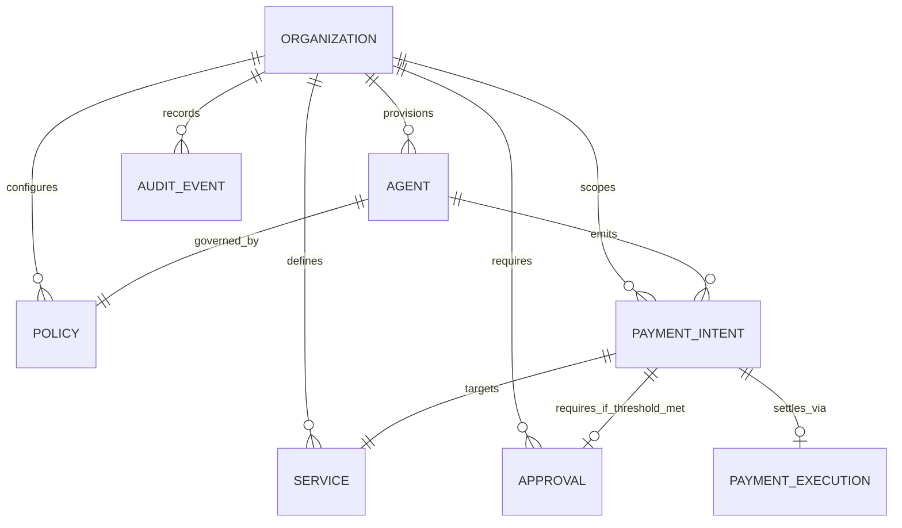

# AgentPay Product Domain Model V2

## 1. Implemented Domain Model Status (Day 1 Complete)

Following the Task 15 Day 1 implementation, AgentPay's core domain model is now explicit, typed, persistent in both PostgreSQL and Memory repositories, and verified by comprehensive automated tests.

| Entity | Implemented | DB Representation | API / Service Layer | UI Representation | Ownership / Relationships | Lifecycle | Security Boundary | Test Coverage |
| :--- | :---: | :---: | :---: | :---: | :--- | :--- | :--- | :---: |
| **Organization** | ✅ Yes | `organizations` table (`id`, `name`, `status`, `created_at`, `updated_at`) | `CreateOrganization`, `GetOrganization`, `ListOrganizations` | Tenant Scope (`org_default`) | Root entity; owns all agents, policies, services | `ACTIVE`, `SUSPENDED` | Cross-tenant queries rejected (`WHERE organization_id = ?`) | Unit tests (`domain_test.go`) |
| **User** | ⚠️ Planned | Day 3 / RBAC phase | Role definitions in domain | Approver Identity | Belongs to Organization; acts as Approver/Operator | `ACTIVE`, `DISABLED` | Approver RBAC | Planned Day 3 |
| **Agent** | ✅ Yes | `agents` table (extended with `organization_id`, `description`, `policy_id`, `vault_address`, `updated_at`) | `CreateAgent`, `UpdateAgent`, `PauseAgent`, `ListAgents` | AgentCard, Agent Detail page | Belongs to Organization; owns PaymentIntents | `ACTIVE`, `PAUSED`, `DISABLED` | Cross-org modification blocked | Unit & Integration |
| **AgentVault** | ⚠️ Partial | Referenced in `agents.vault_address` | Embedded in intent execution flow | NetworkBadge, DeployedResources | 1:1 with Agent on Arc Mainnet | Deployed, Active, Paused | On-chain bytecode (`Ownable`, `Pausable`, `ReentrancyGuard`) | 42 Foundry tests |
| **Policy** | ✅ Yes | `policies` table (`id`, `organization_id`, `agent_id`, limits, allowlists) | `CreatePolicy`, `GetPolicy`, `GetPolicyByAgent` | PolicyCard (read-only display) | Belongs to Organization; 1:1 with Agent | `enabled` (boolean) | Pure integer math; cannot be bypassed | 32 Rust tests + Go tests |
| **Service** | ✅ Yes | `services` table (extended with `organization_id`, `description`, `status`, `max_price`) | `CreateService`, `UpdateService`, `PauseService`, `ListServices` | Service catalog in UI | Belongs to Organization (or global) | `ACTIVE`, `SUSPENDED`, `DEPRECATED` | Recipient address locked server-side | Unit & Integration |
| **PaymentIntent** | ✅ Yes | `payment_intents` table (extended with `organization_id`, `request_id`, `policy_decision`, `requires_approval`) | `CreatePaymentIntent`, `RecordPolicyDecision`, `ListIntents` | IntentTable, Intent Detail, Demo Pipeline | Emitted by Agent for a Service | Full state machine: `CREATED`, `AUTHORIZED`, `APPROVAL_REQ`, `APPROVED`, etc. | Idempotency unique index, atomic CAS | Comprehensive unit & integration |
| **PaymentExecution** | ✅ Yes | `payment_executions` table (`intent_id`, `tx_hash`, `status`, timestamps) | `RecordExecution`, `GetExecution`, `ListExecutions` | TransactionTable, Tx Detail | 1:1 with PaymentIntent | `SUBMITTED` → `CONFIRMED`/`FAILED` | Signed by Executor private key; receipt verified on Arc | Integration tests |
| **Approval** | ✅ Yes | `approvals` table (`id`, `organization_id`, `payment_intent_id`, `required`, `status`, approver, reason) | `RecordApproval`, `GetApprovalByIntent`, `ListApprovals` | Approval queue | Belongs to Organization and PaymentIntent | `PENDING`, `APPROVED`, `REJECTED`, `EXPIRED` | **Cannot approve DENIED policy outcomes** | Unit tests (`domain_test.go`) |
| **Transaction** | ✅ Yes | Represented via `payment_executions` | `GET /v1/transactions`, `GET /v1/transactions/{hash}` | TransactionTable, Tx Detail | Tied to Execution and Arc Mainnet receipt | Mined, Confirmed, Failed | On-chain receipt & event log validation | Integration & Frontend |
| **AuditEvent** | ✅ Yes | `audit_events` table (append-only) | `RecordAuditEvent`, `ListAuditEvents` | Live log console | Belongs to Organization | Immutable append-only log | No `UPDATE`/`DELETE` grants permitted | Unit tests (`domain_test.go`) |
| **Webhook** | ⚠️ Planned | Planned Day 6 | Webhook model documented | N/A | Belongs to Organization; triggered on lifecycle events | Active, Disabled | HMAC-SHA256 signatures | Planned Day 6 |
| **APIKey** | ⚠️ Planned | Planned Day 1b / Day 2 | Middleware placeholder | Settings API | Belongs to Organization | Active, Revoked | SHA-256 hashed at rest | Planned Day 2 |

---

## 2. Canonical Product Domain Model V2

### Key Invariants Established on Day 1:
1. **Multi-Tenant Scoping**: All entities now reference `organization_id`. Cross-organization modifications are rejected with `ErrOrganizationMismatch`.
2. **Deterministic Precedence**: Approval workflows cannot override a `DENY` policy outcome.
3. **Integer Base Units**: All monetary values are integer base unit strings (micro-USDC). No floating-point math.
4. **Idempotency**: Unique constraint on `(organization_id, request_id)` guarantees duplicate requests return the existing intent without creating duplicate payments.
5. **Append-Only Auditing**: Every agent state change, service update, payment transition, and approval emits an immutable `AuditEvent`.
