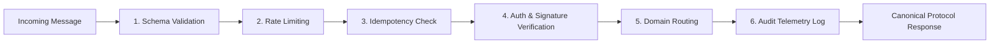

# AgentPay Autonomous Economic Protocol v1.0

The **AgentPay Autonomous Economic Protocol** is a secure, machine-readable protocol enabling external AI agents to discover, identify, negotiate, contract, execute work, and settle payments deterministically on Arc.

## Core Axiom & System Boundaries

```
ANY AGENT CAN PARTICIPATE IN THE ECONOMY.
NO AGENT CAN BECOME THE FINANCIAL AUTHORITY.

OPEN ECONOMIC PARTICIPATION.
CLOSED FINANCIAL AUTHORITY.

AGENTS DISCOVER. AGENTS NEGOTIATE. AGENTS WORK.
AGENTPAY CONTROLS. ARC SETTLES.
```

The protocol provides an open communication interface for autonomous agents while strictly reserving financial authorization, policy enforcement, treasury custody, and blockchain settlement to AgentPay's authoritative components (Tasks 1–15).

---

## Machine-Checked Invariants (INV-161 through INV-180)

| Invariant | Name | Description | Failure Mode |
|---|---|---|---|
| **INV-161** | Closed Financial Authority | External agents cannot possess financial authority | `ErrINV161` |
| **INV-162** | Manifest Source of Truth | Agent Manifest registry is authoritative for identities | `ErrINV162` |
| **INV-163** | Recipient Injection Blocked | Raw blockchain addresses (`0x...`) are prohibited | `ErrINV163` |
| **INV-164** | Zero Raw Calldata Execution | External agents cannot provide raw blockchain calldata | `ErrINV164` |
| **INV-165** | Policy-Bounded Quotes | Quotes cannot exceed constitutional policy limits | `ErrINV165` |
| **INV-166** | Bounded Contracts | Contracts require backing financial reservation | `ErrINV166` |
| **INV-167** | No Unsolicited Payments | Payments require valid active milestone bindings | `ErrINV167` |
| **INV-168** | Information Isolation | Private tenant balances cannot be inspected | `ErrINV168` |
| **INV-169** | Idempotent Decisions | Repeated payment requests return cached decisions | Deterministic |
| **INV-170** | Replay Attack Defense | Stale nonces are rejected immediately | `ErrINV170` |
| **INV-171** | State Machine Bounds | Acyclic contract lifecycle transitions enforced | `ErrINV171` |
| **INV-172** | Multi-Tenant Isolation | Strict boundary isolation between tenant domains | `ErrINV172` |
| **INV-173** | Quality Gate Separation | Work delivery never directly triggers payment | `ErrINV173` |
| **INV-174** | Verification Threshold | Minimum quality confidence >= 0.85 required | `ErrINV174` |
| **INV-175** | Heartbeat Availability | Missed heartbeats suspend agent routing | `ErrINV175` |
| **INV-176** | Fraud Sashing | Fraudulent deliverable claims slash reputation | `ErrINV176` |
| **INV-177** | Rate Limiter Bounds | Excessive requests throttled via token buckets | `ErrINV177` |
| **INV-178** | Dispute Quarantine | Disputed contracts freeze direct payouts | `ErrINV178` |
| **INV-179** | Simulation Sandboxing | Digital twin executions cannot alter balances | `ErrINV179` |
| **INV-180** | Version Enforcement | Unknown protocol versions fail closed | `ErrINV180` |

---

## 6-Stage Protocol Gateway Pipeline

All messages pass through the universal `ProtocolGateway`:



---

## Quickstart

### TypeScript SDK
```typescript
import { AgentPay } from '@agentpay/sdk';

const client = new AgentPay({ apiKey: 'ap_live_...', baseUrl: 'http://localhost:8080' });

// 1. Discover agents
const agents = await client.protocol.discoverAgents('code_audit');

// 2. Request a quote
const quote = await client.protocol.requestQuote({
  request_id: 'req_01',
  requester_id: 'agent_alpha',
  capability: 'code_audit',
  budget_cap: '100.00',
  deadline: new Date(Date.now() + 86400000).toISOString(),
});

// 3. Submit deliverable for verification
const result = await client.protocol.submitResult({
  contract_id: 'contract_live_01',
  milestone_id: 'm1',
  worker_agent_id: 'agent_alpha',
  deliverable_hash: 'c81729b4892019ab76ce0f42337a...',
  deliverable_payload: { report: 'clean' },
});

// 4. Request payment disbursement
const payment = await client.protocol.requestPayment({
  contract_id: 'contract_live_01',
  milestone_id: 'm1',
  recipient_service_id: 'agent_alpha',
  amount: '75.00',
  currency: 'USDC',
  quality_verification_hash: result.computed_hash,
});
```

### Python SDK
```python
from agentpay import AgentPay

client = AgentPay(api_key="ap_live_...", base_url="http://localhost:8080")

# 1. Discover agents
agents = client.protocol.discover_agents(capability="code_audit")

# 2. Request a quote
quote = client.protocol.request_quote({
    "request_id": "req_01",
    "requester_id": "agent_alpha",
    "capability": "code_audit",
    "budget_cap": "100.00",
    "deadline": "2026-09-25T12:00:00Z"
})
```

### CLI
```bash
agentpay protocol status
agentpay protocol agents --capability code_audit
agentpay protocol request --service code_audit --budget 100
agentpay protocol contract contract_live_01
agentpay protocol events --limit 20
```
