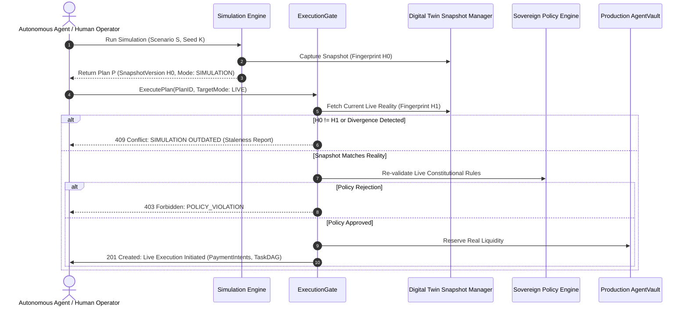

# Simulation-to-Live Execution Transition & Staleness Revalidation

## Overview

A fundamental challenge in autonomous economic simulation is the transition from **Hypothetical Prediction** to **Real-World Execution**. If an agent or human operator decides to "Execute This Plan," the system must guarantee that real-world conditions have not drifted between the time the simulation was run and the moment live execution begins.

The **Execution Gate** (`ExecutionGate`) bridges this gap. It provides a formal, transactional protocol to evaluate plan freshness, re-verify policy constraints, check real-time liquidity, and safely convert a `SimulationExecutionPlan` into live payment intents with zero chance of blind execution.

---

## The Execution Transition Protocol

---

## Staleness Detection (`SIMULATION OUTDATED`)

The `ExecutionGate` performs a strict multi-point comparison before allowing any simulated plan to execute:

1. **Snapshot Fingerprint Validation:**  
   The plan contains the cryptographic fingerprint `SnapshotVersion` captured when the simulation was run. If the active organization's digital twin state has been modified (e.g. balance changed, new agent registered, service deprecated), the current fingerprint will not match:
   $$\text{Fingerprint}(t_0) \neq \text{Fingerprint}(t_{\text{live}})$$

2. **Budget Drift Check:**  
   The gate checks whether the agent's currently remaining budget is strictly greater than or equal to the plan's worst-case exposure:
   $$\text{RemainingLiveBudget} \ge \text{Plan}.\text{WorstCaseExposure}$$
   If another transaction consumed budget in the interim, execution is rejected.

3. **Service & Policy Invalidation:**  
   The gate re-verifies that all services selected in the simulation plan remain active, enabled, and within acceptable reputation scores. If any service was disabled or experienced a price hike, execution is blocked.

4. **Time-to-Live (TTL) Expiration:**  
   Simulation plans carry an expiration timestamp (default: 5 minutes). Plans older than the TTL are automatically rejected with `PLAN_EXPIRED`.

---

## Plan Conversion Pipeline

When a plan passes all freshness checks, the `ExecutionGate` converts each `SimulationPlanStep` into live entities:

1. **Transaction Grouping:** Steps with no inter-dependencies are batched for concurrent execution.
2. **Intent Reservation:** Live payment intents are created in `DRAFT` status with a bound quote ID and an idempotency key derived from `(PlanID, StepID, Nonce)`.
3. **Audit Cross-Reference:** The live execution plan retains the `SimulationRunID` in its metadata, creating an end-to-end cryptographic link between the original prediction and the live outcome.
