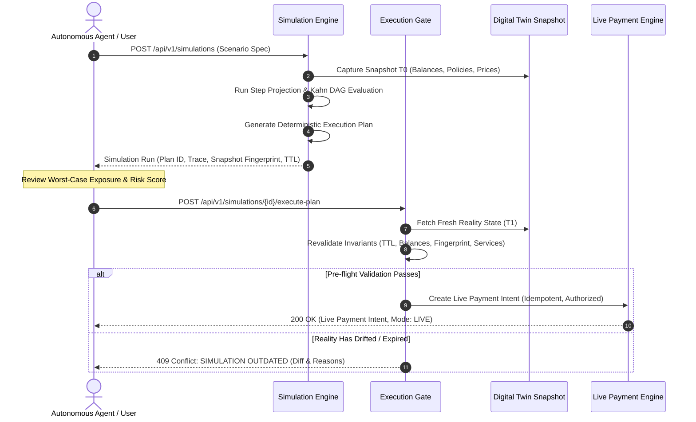

# AgentPay Simulator: Execution Plans & Live Conversion Gate

## 1. Overview & Architectural Goals

The **Execution Gate** bridges the gap between pre-execution simulation and live financial settlement. It allows developers, autonomous agents, and risk operators to inspect a fully simulated execution plan, understand its tail financial exposure, and transition it to live execution with one click or API call.

Crucially, **an execution plan is NOT a blank check**. 

Between the time a simulation completes and an agent attempts to execute the plan:
1. Gas prices or on-chain transaction fees may spike.
2. The agent's available wallet/treasury balance may have been spent by concurrent tasks.
3. Merchant API service rates may experience dynamic surge pricing or outages.
4. Policy rules (e.g. daily velocity limits or category whitelists) may have changed.
5. The plan itself may have expired (default TTL: 15 minutes).

The **Execution Gate** (`services/gateway/internal/simulation/execution_gate.go`) guarantees that stale or invalidated plans are **never executed blindly**.

---

## 2. The Plan Generation Lifecycle



---

## 3. Pre-Flight Verification Criteria

Before a simulation plan can generate a live payment intent or grant execution authority, the `ExecutionGate` verifies 5 strict conditions:

### 3.1 Expiration Check (TTL)
Each simulation execution plan has an immutable `ExpiresAt` timestamp. By default, plans expire after **15 minutes** ($900\text{ seconds}$).
```go
if time.Now().UTC().After(plan.ExpiresAt) {
    return nil, &StalenessError{
        Reason: "SIMULATION OUTDATED: execution plan has expired",
        ExpiredAt: plan.ExpiresAt,
    }
}
```

### 3.2 Digital Twin Fingerprint Revalidation
The simulation plan records the SHA-256 fingerprint of the `SimulationSnapshot` used during the run. The gate captures fresh reality state $T_1$ and verifies the fingerprint:
$$\text{Fingerprint}(T_0) \stackrel{?}{=} \text{Fingerprint}(T_1)$$
If any agent balance, merchant rate, or policy configuration changed in the interim, the fingerprints diverge, triggering a `SIMULATION OUTDATED` abort.

### 3.3 Balance Sufficiency Re-check
The gate checks whether the agent's current live balance covers the **Worst-Case Exposure** of the plan (which accounts for retry multipliers, slippage, and maximum provider rates):
```go
if currentBalance < plan.WorstCaseExposure {
    return nil, fmt.Errorf("insufficient funds for worst-case execution: required %s, available %s",
        plan.WorstCaseExposure, currentBalance)
}
```

### 3.4 Service Availability & Price Slippage
If a merchant service provider has degraded, tripped a circuit breaker, or increased its dynamic rate beyond the plan's slippage tolerance ($\pm 5\%$), the gate rejects the plan and recommends re-simulation.

### 3.5 Kahn DAG Step Sequence Integrity
The gate asserts that all steps in the plan strictly adhere to the DAG dependency graph. Step parameters, recipient addresses, and payment caps are frozen and cannot be tampered with between simulation and live execution.

---

## 4. API Specification: Executing a Plan

### Endpoint
`POST /api/v1/simulations/{id}/execute-plan`

### Request Headers
```http
Authorization: Bearer <API_KEY>
X-Tenant-ID: <TENANT_ID>
Content-Type: application/json
```

### Request Body
```json
{
  "max_allowed_cost": "2.50",
  "idempotency_key": "exec_req_84f9a0c2_12e",
  "force_revalidation": true
}
```

### Successful Response (200 OK)
```json
{
  "status": "APPROVED",
  "live_payment_intent_id": "pi_live_938b712c98a",
  "simulation_id": "sim_98a72f012",
  "execution_mode": "LIVE",
  "authorized_budget": "1.85",
  "worst_case_exposure": "2.20",
  "authorized_steps": 3,
  "created_at": "2026-09-23T18:00:00Z"
}
```

### Stale Simulation Response (409 Conflict)
```json
{
  "error": "SIMULATION_OUTDATED",
  "message": "SIMULATION OUTDATED: snapshot fingerprint mismatch (expected sha256:7f9a8b..., got sha256:12c4d5...). Live balances or merchant service rates have changed.",
  "simulation_id": "sim_98a72f012",
  "recommended_action": "RERUN_SIMULATION"
}
```

---

## 5. UI Integration in Mission Control

In the Web Mission Control (`apps/web/src/app/simulator/page.tsx`):
1. **Interactive Plan Review:** Once a simulation run finishes, the **Execution Plan** card renders the deterministic sequence of steps, authorized service endpoints, and total estimated vs worst-case costs.
2. **"Execute This Plan" Button:**
   - Highlights in green when the plan is valid and fresh.
   - Automatically disables and displays a **`SIMULATION OUTDATED`** badge if the TTL expires or if live balances change.
   - Clicking triggers the pre-flight check with immediate visual feedback.
3. **Safety Confirmations:** High-value or high-risk runs require explicit human operator confirmation before the live payment intent is dispatched.
