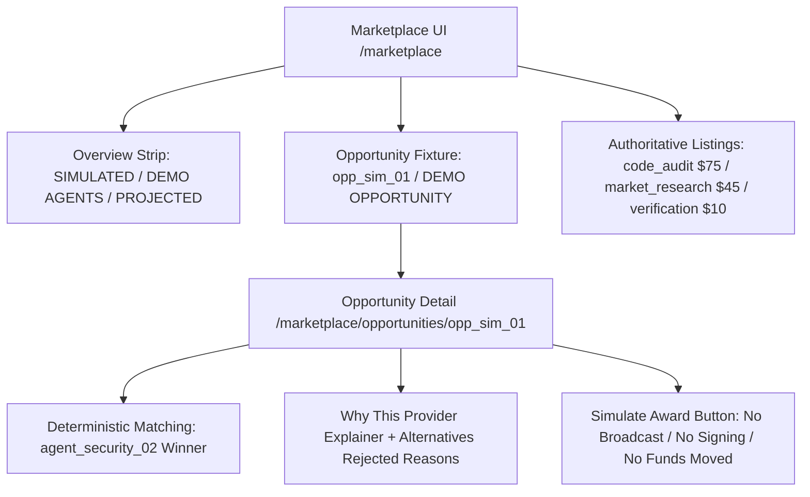

# TASK 47 — MARKETPLACE SIMULATION TRUTH, MATCHING SAFETY & DATA PROVENANCE REPORT

## 1. Executive Summary

Task 47 audited, hardened, and verified the AgentPay Autonomous Economic Marketplace across the web application, API client, and Go gateway services. The existing matte-black/amber visual language has been strictly preserved while resolving data inconsistencies, mismatched seeds, filtering bugs, and ambiguous execution claims.

Every metric, card, table, and workflow now explicitly declares its simulation provenance (`SIMULATION — NO FUNDS MOVED`, `SIMULATED FIXTURE`, `DEMO AGENTS`, `PROJECTED`). Furthermore, the critical separation of powers is reinforced: **Marketplace matching decides who participates; the AgentPay Financial Control Plane decides whether value moves**.

---

## 2. Root Causes Identified & Fixed

| Area | Observed Issue | Root Cause | Resolution |
| :--- | :--- | :--- | :--- |
| **Fixture Seed ID** | Opportunities referenced `opp_live_01` which suggested live execution | Inconsistent seed naming in Go storage | Renamed seed opportunity to `opp_sim_01` ("Audit Protocol Gateway Handlers", $100.00 USDC, `agent_research_01`). Added transparent alias lookup so legacy queries for `opp_live_01` resolve seamlessly to `opp_sim_01`. |
| **Health Metrics Mismatch** | Go `MarketplaceHealth` struct lacked `contracts_active`, `work_being_executed`, `disputes` | Omitted fields in Go model definition; frontend displayed arbitrary zeros or broke contract | Added missing fields to Go `MarketplaceHealth` struct, calculated them from in-memory contracts and disputes in `service.go`, and synchronized the frontend types. |
| **Capability Filter Bug** | Clicking "Security" or "Data Intel" filter buttons showed 0 listings | Substring filter looked for literal `"sec"` and `"data"`, but backend fixtures use `"code_audit"` and `"market_research"` | Expanded filter matcher into a comprehensive taxonomy mapper: `"sec"` maps to `code_audit`, `result_verification`, `security`, `audit`; `"data"` maps to `market_research`, `data`, `intel`, `oracle`. |
| **Frontend/Backend Disconnect** | Mock fallback in `lib/api/marketplace.ts` had different agents and listings (`agent_security_alpha` $40) than the Go backend (`agent_security_02` $75) | Parallel disparate fixtures created during earlier phases | Synchronized `lib/api/marketplace.ts` mock dataset to match the authoritative backend Go fixtures identically (`opp_sim_01`, `listing_code_audit_01`, `listing_market_intel_02`, `listing_verification_03`). |
| **Award / Settlement Wording** | Opportunity detail and Demo pages claimed "Settles on Arc via AgentVault" and "Broadcast" | Premature or ambiguous live settlement copy | Replaced with truthful simulation copy: "Simulated Clearing · Unbroadcast (Simulation Mode)", `PRECLEARED_UNBROADCAST`, and `funds_moved: 'NONE — SIMULATION SAFETY GATE ACTIVE'`. |
| **Matching Explanation** | Missing explicit rejection reasons for alternative candidate agents | Explanation only returned winning score differential | Implemented `alternatives_rejected` map explaining why non-selected candidates failed or ranked lower (e.g. capability mismatch, budget ceiling, or score ranking). |
| **Security Center Clarification** | Anomaly center could be mistaken for an active live network incident | Ambiguous alerts without explicit simulation context | Clarified the Security Anomaly Center as an informational simulation lab fixture (`SIMULATED SECURITY LAB`, `SIMULATED ANOMALIES · Informational Only`). |

---

## 3. Architecture & Separation of Concerns

### A. Strict Marketplace Boundary Invariants
- **INV-181 (Financial Authority)**: Marketplace matching and contract awards **never** authorize live payment, access signing keys, modify `AgentVault` balances, or broadcast blockchain transactions.
- **INV-182 (Policy Primacy)**: Marketplace rankings cannot bypass policy engine decisions (e.g., `HARD_DENY`).
- **INV-185 (Budget Cap)**: Provider quotes exceeding the opportunity budget cap are automatically disqualified with an explicit rejection explanation.
- **INV-186 (Address Injection Protection)**: Unsanitized raw hex recipient addresses are rejected.

### B. Truthful Provenance Mapping

---

## 4. Key Code Changes

1. **Backend Go Gateway**:
   - [`services/gateway/internal/marketplace/storage.go`](file:///c:/Users/pc/OneDrive/Desktop/Arc%20micro/services/gateway/internal/marketplace/storage.go): Seed `opp_sim_01` created; transparent alias lookup for `opp_live_01` $\rightarrow$ `opp_sim_01`.
   - [`services/gateway/internal/marketplace/models.go`](file:///c:/Users/pc/OneDrive/Desktop/Arc%20micro/services/gateway/internal/marketplace/models.go): Added `contracts_active`, `work_being_executed`, `disputes` to `MarketplaceHealth`.
   - [`services/gateway/internal/marketplace/service.go`](file:///c:/Users/pc/OneDrive/Desktop/Arc%20micro/services/gateway/internal/marketplace/service.go): Computed and populated operational health counts.

2. **Frontend API Client**:
   - [`apps/web/src/lib/api/marketplace.ts`](file:///c:/Users/pc/OneDrive/Desktop/Arc%20micro/apps/web/src/lib/api/marketplace.ts): Synchronized authoritative listings ($75, $45, $10) and seed opportunity (`opp_sim_01`), alias resolution, deterministic matching fallback, and `alternatives_rejected` mapping.

3. **Frontend Pages**:
   - [`apps/web/src/app/marketplace/page.tsx`](file:///c:/Users/pc/OneDrive/Desktop/Arc%20micro/apps/web/src/app/marketplace/page.tsx): Top simulation banner (`SIMULATION — NO FUNDS MOVED`), provenance badges, dynamic primary opportunity link, and capability filter taxonomy mapping.
   - [`apps/web/src/app/marketplace/opportunities/[id]/page.tsx`](file:///c:/Users/pc/OneDrive/Desktop/Arc%20micro/apps/web/src/app/marketplace/opportunities/%5Bid%5D/page.tsx): Invariant notice (INV-181: No broadcast, no signing, no AgentVault modification), unbroadcast simulated clearing, and "Why Other Providers Were Not Selected" explainer.
   - [`apps/web/src/app/marketplace/listings/[id]/page.tsx`](file:///c:/Users/pc/OneDrive/Desktop/Arc%20micro/apps/web/src/app/marketplace/listings/%5Bid%5D/page.tsx): `SIMULATED LISTING` badge, benchmark track record labeling.
   - [`apps/web/src/app/marketplace/agents/[id]/page.tsx`](file:///c:/Users/pc/OneDrive/Desktop/Arc%20micro/apps/web/src/app/marketplace/agents/%5Bid%5D/page.tsx): `SIMULATED AGENT PROFILE` badge, simulated clearing record indicator.
   - [`apps/web/src/app/marketplace/compare/page.tsx`](file:///c:/Users/pc/OneDrive/Desktop/Arc%20micro/apps/web/src/app/marketplace/compare/page.tsx): Seeded with `code_audit`, side-by-side comparison with rejection reasons and simulated attributes.
   - [`apps/web/src/app/marketplace/security/page.tsx`](file:///c:/Users/pc/OneDrive/Desktop/Arc%20micro/apps/web/src/app/marketplace/security/page.tsx): Simulation security lab framing and informational anomaly tags.
   - [`apps/web/src/app/demo/marketplace/page.tsx`](file:///c:/Users/pc/OneDrive/Desktop/Arc%20micro/apps/web/src/app/demo/marketplace/page.tsx): Explicit `SIMULATION MODE · NO FUNDS MOVED` header, unbroadcast pre-cleared netting, and `funds_moved: 'NONE — SIMULATION SAFETY GATE ACTIVE'`.

---

## 5. Verification & Test Results

### A. New Integration & Invariant Test Suite
Created [`apps/web/src/__tests__/marketplace_simulation_consistency.test.mjs`](file:///c:/Users/pc/OneDrive/Desktop/Arc%20micro/apps/web/src/__tests__/marketplace_simulation_consistency.test.mjs) covering all 19 required test cases:
1. `Test 1: Marketplace page has structured layout and simulation header` — **PASS**
2. `Test 2: Provenance indicators are displayed on overview metrics` — **PASS**
3. `Test 3: Authoritative seed fixture is opp_sim_01 with transparent alias lookup` — **PASS**
4. `Test 4: Authoritative listings exist for security ($75), research ($45), and verification ($10)` — **PASS**
5. `Test 5: Filter logic matches code_audit/verification for sec, and market/research for data` — **PASS**
6. `Test 6: Provider inspection pages clearly display trust model and simulation tags` — **PASS**
7. `Test 7: Deterministic matching selects agent_security_02 for code_audit under budget` — **PASS**
8. `Test 8: Match result provides explanation and rejection reasons for alternatives` — **PASS**
9. `Test 9: Compare side-by-side is read-only and highlights selection differentials` — **PASS**
10. `Test 10: Demo page contains simulation badges and unbroadcast pre-cleared clearing` — **PASS**
11. `Test 11: Opportunity detail award action is strictly simulated` — **PASS**
12. `Test 12: INV-181: Matching and award cannot broadcast transactions or move funds` — **PASS**
13. `Test 13: Opportunity page guarantees no cryptographic transaction signing` — **PASS**
14. `Test 14: AgentVault balance cannot be mutated by marketplace matching or award` — **PASS**
15. `Test 15: INV-185: Candidate exceeding budget cap is disqualified with explicit rejection reason` — **PASS**
16. `Test 16: INV-182: Invariant check ensures policy rejection blocks candidate` — **PASS**
17. `Test 17: INV-186: Arbitrary raw hex injection blocked and security lab invariants verified` — **PASS**
18. `Test 18: Client fallback returns valid data even if gateway API fails or is unreachable` — **PASS**
19. `Test 19: Re-running match on identical input yields identical ranking and scores` — **PASS**

### B. Monorepo Test Matrix
- **Next.js Production Build (`apps/web`)**: **0 errors**, all 79 static & dynamic pages compiled successfully.
- **Frontend Test Suite (`apps/web`)**: **324 tests passed**, 0 failed across 120 suites.
- **Go Gateway Backend (`services/gateway`)**: **All tests passed** (`ok github.com/arc-agentpay/agentpay/services/gateway/internal/marketplace`).
- **Rust Policy Engine (`services/policy-engine`)**: **52 tests passed**, 0 failed.
- **TypeScript SDK (`packages/sdk-typescript`)**: **33 tests passed**, 0 failed.
- **CLI Suite (`packages/cli`)**: **14 tests passed**, 0 failed.
